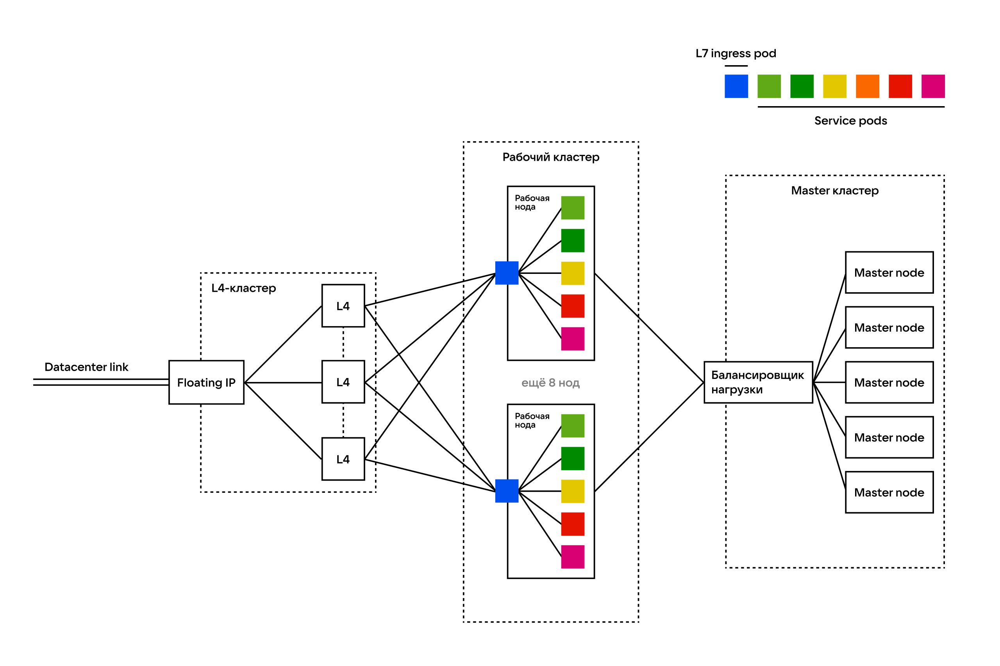

# Netflix | Highload

- Студент: Васютенко Роман Сергеевич
- Группа: WEB-31

## 1. Тема и целевая аудитория

**Тема сервиса:** видеостриминговая платформа с персональными рекомендациями, несколькими профилями, офлайн-загрузками и поддержкой высокого качества (HD/4K).

**Основные регионы:** США — 81,44 млн подписчиков, Великобритания — 18,4 млн, Германия — 16,59 млн, Бразилия — 16,59 млн \[1]

**Целевая аудитория:** глобальная аудитория платных подписчиков Netflix.

**Оценочный размер аудитории (MAU):** 301,6 млн платных аккаунтов. \[1]

> В отчётах Netflix «members» — это платные аккаунты; реальное количество индивидуальных зрителей/профилей может быть выше.

### Ключевой функционал MVP

1. Воспроизведение видео
2. Поиск и навигация по каталогу видео
3. Персональная лента рекомендаций (на основе просмотров и профилей).
4. История просмотров, подборки фильмов/сериалов
5. Управление аккаунтом
6. Оффлайн-загрузки и управление скачанными файлами

(Дополнительный функционал включает в себя: лайки/рецензии, live-стримы, торговые интеграция и т.п.)

## 2. Расчет нагрузки
### Продуктовые метрики 

| Метрика                                                                 |                                                                      Значение | Примечание                                                            |
| ----------------------------------------------------------------------- | -------------------------------------------------------------------------------------: | -------------------------------------------------------------------------------- |
| MAU (аккаунты с подпиской)                                      |                                                                        **300 000 000** | округлённо по отчётам 2025 года \[1] |
| Часы просмотра                                     |                                                 **95 000 000 000 часов** | официальная метрика Netflix (за первую половину 2025) \[2]        |
| Средние часы просмотра в день (на одного пользователя)                         |                                                                      ≈ **1,75 ч/день** | вычислено: (95B / 181 день) / MAU ≈ 525M часов/день / 300M ≈ 1,75 ч/день         |
| DAU — дневная аудитория           |                                                   **≈ 120–180 млн** (предположительно) | берём диапазон 40–60% MAU, так как точное значение не обнародовано |
| Средний объём памяти на аккаунт        |                                                                        **\~50–200 Мб** | профили, метаданные, watch history, bookmarks               |
| Средний объём скачанных материалов на аккаунт |                                                                          **\~1–10 Гб** | зависит от привычек пользователя (в среднем 1–4 фильма/сериала)                          |
| Среднее количество просмотров/просмотров видео на пользователя в день   | ≈ **3,5 просмотров/день** | вычислено: ≈ (1,75 ч/день) / (средняя длительность просмотра — 0,5 ч), если принять среднюю сессию ≈ 30 мин.                                            |

> Для расчётов трафика использованы следующие допущения по распределению качества стрима: SD 30%, HD 60%, 4K 10%.

### Технические метрики

#### 1. Входные исходные величины и допущения

* 95 млрд часов просмотра
* Рассчётные дни в полугодии: 181 день → **суммарно 95 млрд часов ⇒ \~524 861 878 часов/день** (daily\_hours).
* Распределение по качествам (допущение): SD 30% (0.7 Мбит/с), HD 60% (5.0 Мбит/с), 4K 10% (15 Мбит/с). \[3]
* Средняя длительность сегмента/запроса (chunk) для ABR: **4 секунды** (допущение, среднее значение для DASH/HLS варианта).
* Кривые пиков: считаем, что **20% от суточного трафика** приходится на час пик (допущение, приближённая оценка для крупных потоковых платформ).

#### 2. Расчёт трафика

Вычисления:

* Средневзвешенное значение битрейта (avg\_bitrate) = 0,6 × 5 + 0,3 × 0,7 + 0,1 × 15 = **4,71 Мбит/с**
* Ежедневный объём исходящего трафика (Мбит/день) = (daily\_hours) × 3600 × avg\_bitrate

**Результат (округлено):**

| Показатель                                                  |                                   Значение |
| ----------------------------------------------------------- | -----------------------------------------: |
| Средняя скорость потока (взвешенная)                        |                              **4,71 Мбит/с** |
| Суточный исходящий трафик (Гб/день)                         |                  **\~1,11 × 10^9 Гб/день** |
| Суточный исходящий трафик (Тб/день)                         | **\~1,09 × 10^6 Тб/день** |
| Пиковая пропускная способность (час пик, 20% трафика в час) |            **\~494 400 Гбит/с ≈ 494 Тбит/с** |

#### 3. Расчёт среднего и пикового RPS (запросы в секунду)

* Среднее количество одновременных зрителей: `avg_concurrent = daily_hours / 24 ≈ 21.87 млн`
* Пиковое количество одновременных зрителей (если 20% трафика в пиковый час): `peak_concurrent = daily_hours * 0.2 ≈ 105 000 000`
* Пусть каждый поток делает **1 HTTP-запрос сегмента каждые 4 секунды**. Тогда `RPS = (количество одновременных зрителей) / 4`

| Тип запросов                       |      RPS средний |       RPS пиковый |
| ---------------------------------- | ---------------: | ----------------: |
| HTTP запросы видео-сегментов (CDN) | **\~5,47 млн RPS** | **\~26,24 млн RPS** |

> RPS расчитан для CDN (множество лёгких GET запросов сегментов). RPS на API (метаданные, аутентификация, рекомендации) существенно меньше.

#### 4. Оценка объёма хранения каталога

Исходные данные и допущения:

* Размер каталога согласно отчётам: **\~18 000 единиц контента** \[4]
* Средняя продолжительность контента: пусть **1,5 часа** с учётом наличия как сериалов, так и фильмов (допущение)
* Кодирование/варианты хранения: SD + HD + 4K + аудиодорожки + обложки. Тогда пусть средний объём закодированных файлов ≈ **20 Гб** на единицу контента
* Репликация по CDN/edge: Netflix использует Open Connect и размещает копии в крупных IX/ISP. Пусть репликационный коэффициент равен **10** для грубой оценки.

Тогда:

* Объем памяти для всего контента, хранящегося в едином экземпляре: 18 000 × 20 Гб = **360 000 Гб ≈ 351,6 Тб**
* С учётом репликации ×10: **≈ 3,5 Пб**

> Учитывается только основная библиотека закодированных файлов. Дополнительные хранилища: сырьё/мастера, ВК, резервные копии, ML-датасеты и т.п. — значительно увеличат объём.

## 3. Глобальная балансировка нагрузки

### Расположение датацентров

Основано на расположении датацентров AWS и Netflix Open Connect [5].

| Регион         | Расположение ДЦ                                | Пользователи | Failover ДЦ        |
| -------------- | ---------------------------------------------- | ------------ | ------------------ |
| США            | Северная Вирджиния, Огайо, Северная Калифорния | 81,44M       | Торонто, Мехико    |
| Европа         | Германия (Франкфурт), Великобритания (Лондон)  | 35M          | Дубай              |
| Южная Америка  | Бразилия (Сан-Паулу)                           | 16,59M       | Мехико             |
| Канада         | Торонто                                        | 5M           | Северная Вирджиния |
| Азия           | Сингапур, Токио                                | 10M          | Дубай              |
| Австралия      | Сидней                                         | 5M           | Сингапур           |
| Ближний Восток | ОАЭ (Дубай)                                    | 2M           | Мумбаи             |
| Мексика        | Мехико                                         | 3,5M         | Сан-Паулу          |

> Для глобальной балансировки используется **GeoDNS**, чтобы пользователи направлялись на ближайший датацентр.
> **DNS Failover** позволяет автоматически переключать трафик на резервные ДЦ при отказе основного.

---

### Разбиение на поддомены / сервисы

| Поддомен / сервис       | Назначение                                     | Характер трафика               | RPS     |
| ----------------------- | ---------------------------------------------- | ------------------------------ | ------- |
| `netflix.com`           | Основной веб-сайт                              | Минимальный                    | 500     |
| `api.netflix.com`       | Метаданные, рекомендации, управление профилями | Средний, write-heavy           | 50 000  |
| `search.netflix.com`    | Поиск контента                                 | Высокий, read-heavy            | 120 000 |
| `content.netflix.com`   | Основной видеоконтент (CDN)                    | Очень высокий, bandwidth-heavy | 26,24M   |
| `images.netflix.com`    | Превью, обложки                                | Высокий, cacheable             | 1,2M    |
| `auth.netflix.com`      | Авторизация и управление аккаунтами            | Средний                        | 30 000  |
| `downloads.netflix.com` | Оффлайн-загрузка видео                         | Высокий                        | 5 000   |

> RPS рассчитан с учётом среднего и пикового числа одновременных пользователей (см. раздел 2). Основной трафик приходится на `content.netflix.com` (CDN), остальные сервисы поддерживают управление метаданными, поиск и авторизацию.

## 4. Локальная балансировка нагрузки

### Балансировка уровней L4 и L7

**L4 — HAProxy / Nginx:**

* Балансировка TCP/UDP соединений
* Используется для статики и видеоконтента
* Алгоритм: Round Robin с весами по производительности серверов

**L7 — Nginx / Envoy:**

* Балансировка HTTP/HTTPS запросов
* Используется для API, поиска, рекомендаций и управления аккаунтами
* Алгоритм: Least Connections с health checks

> SSL Termination выполняется на уровне Ingress подов Kubernetes, снижая нагрузку на сервисные контейнеры. Оркестрация через Kubernetes обеспечивает масштабируемость и надёжность.

---

### Расчёт серверов на один ДЦ (пример: США)

* Пользователей на один ДЦ США: 81,44M / 3 = 27,14M
* Доля общего RPS: 27,14M / MAU = 27,14M / 300M ≈ 0,09
* Глобальный RPS каждого поддомена умножаем на 0,09

| Поддомен                | Глобальный RPS | RPS на ДЦ США | Серверы / поды | RPS/сервер |
| ----------------------- | -------------- | ------------- | -------------- | ---------- |
| `content.netflix.com`   | 26,24M         | 2,36M         | 12             | 196,7k     |
| `images.netflix.com`    | 1,2M           | 108k          | 4              | 27k        |
| `search.netflix.com`    | 120k           | 10,8k         | 2              | 5,4k       |
| `auth.netflix.com`      | 30k            | 2,7k          | 1              | 2,7k       |
| `api.netflix.com`       | 50k            | 4,5k          | 1              | 4,5k       |
| `downloads.netflix.com` | 5k             | 0,45k         | 1              | 0,45k      |

> Под «Серверы / поды» понимаются Kubernetes поды, распределённые по нодам кластера с anti-affinity для отказоустойчивости.

---

### Kubernetes ноды

* AWS инстансы c5.large (2 vCPU, 4GB RAM)
* Каждый инстанс может поддерживать 5 сервисных подов + 1 Ingress под
* Всего требуется 33 пода → минимум 7 нод
* Для надёжности используем 10 рабочих нод (выдерживают падение 3 нод)
* Мастер-ноды Kubernetes: 5 (для надежности etcd)
* L4 балансировщики над рабочими нодами: 3 (active/passive)

> Ingress поды обрабатывают L7 трафик, DNS поддомены и SSL Termination. L4 балансировщики распределяют TCP/UDP соединения для всего кластера.

---

### Схема локальной балансировки

### Использованные источники

1. Основные регионы по распространенности сервиса и количество зарегистрированных пользователей: [www.demandsage.com](https://www.demandsage.com/netflix-subscribers)

2. Суммарные часы просмотра за первую половину 2025 года: [about.netflix.com](https://about.netflix.com/news/what-we-watched-a-netflix-engagement-report)

3. Данные объёма трафика за час по качествам и технические публикации о битрейтах: [help.netflix.com](https://help.netflix.com/en/node/87)

4. Размер каталога контента: [about.netflix.com](https://about.netflix.com/news/what-we-watched-a-netflix-engagement-report)

5. Официальная страница Open Connect: [openconnect.netflix.com](https://openconnect.netflix.com)
