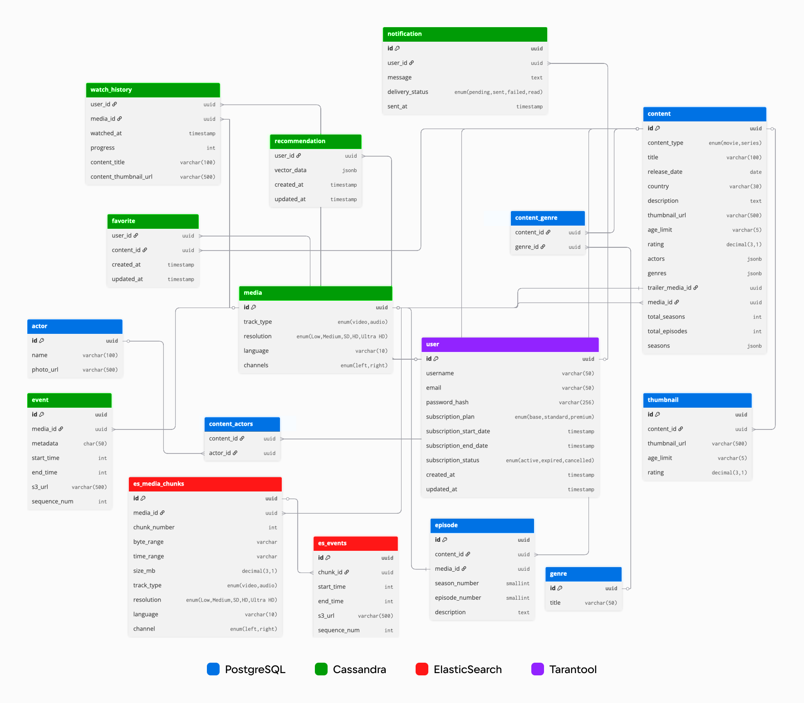
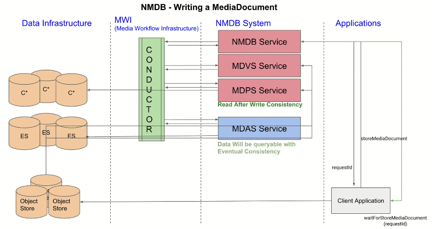
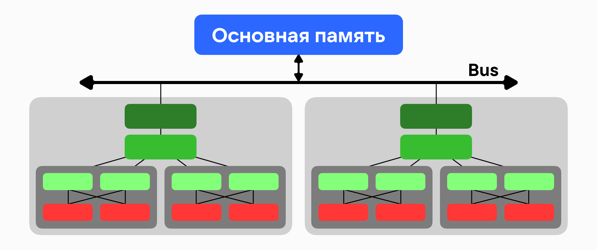
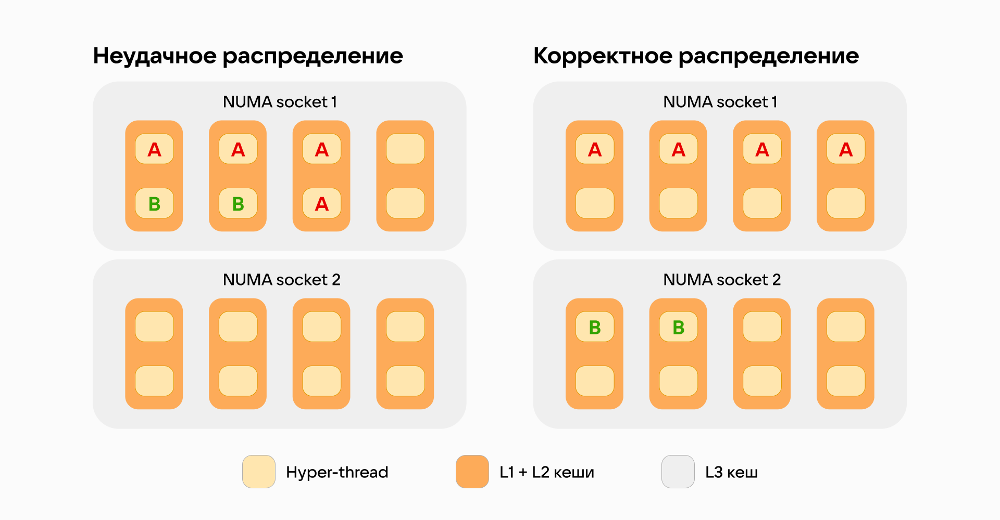
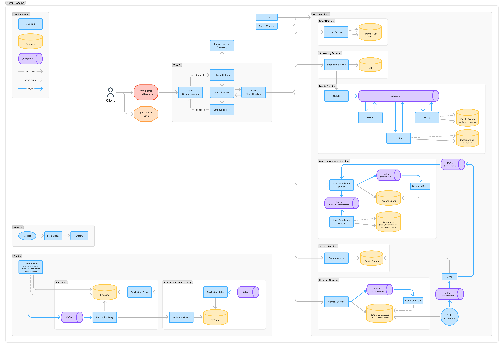

# Netflix | Highload

- Студент: Васютенко Роман Сергеевич
- Группа: WEB-31

## Содержание:
1. [Тема и целевая аудитория](#1-тема-и-целевая-аудитория)
2. [Рассчет нагрузки](#2-расчет-нагрузки)
3. [Глобальная балансировка нагрузки](#3-глобальная-балансировка-нагрузки)
4. [Локальная балансировка нагрузки](#4-локальная-балансировка-нагрузки)
5. [Логическая схема БД](#5-логическая-схема-бд)
6. [Физическая схема БД](#6-физическая-схема-бд)
7. [Алгоритмы](#7-алгоритмы)
8. [Технологии](#8-технологии)
9. [Обеспечение надежности](#9-обеспечение-надежности)
10. [Схема проекта](#10-схема-проекта)
11. [Список серверов](#11-список-серверов)
12. [Список источников](#список-источников)

---

## 1. Тема и целевая аудитория

**Тема сервиса:** видеостриминговая платформа с персональными рекомендациями, несколькими профилями, офлайн-загрузками и поддержкой высокого качества (HD/4K).

**Основные регионы:** США — 81,44 млн подписчиков, Великобритания — 18,4 млн, Германия — 16,59 млн, Бразилия — 16,59 млн [^100]

**Целевая аудитория:** глобальная аудитория платных подписчиков Netflix.

**Оценочный размер аудитории (MAU):** 301,6 млн платных аккаунтов. [^100]

> В отчётах Netflix «members» — это платные аккаунты; реальное количество индивидуальных зрителей/профилей может быть выше.

### Ключевой функционал MVP

1. Воспроизведение видео
2. Поиск и навигация по каталогу видео
3. Персональная лента рекомендаций (на основе просмотров и профилей).
4. История просмотров, подборки фильмов/сериалов
5. Управление аккаунтом
6. Оффлайн-загрузки и управление скачанными файлами

(Дополнительный функционал включает в себя: лайки/рецензии, live-стримы, торговые интеграция и т.п.)

---

## 2. Расчет нагрузки

### Продуктовые метрики
- MAU = `301,6 млн` * [^1]
- DAU = 35% * MAU = `105,6 млн` *
- Средняя продолжительность подписки: `4 года` [^5]
- Размер библиотеки: `19 500` **
- Соотношение фильмов и сериалов в библиотеке - `70%` и `30%` соответсвенно [^6]
- 85% потребляемого пользователями в США контента — сериалы [^7]

#### Размер истории просмотров пользователя
- Если соотношение фильмов и сериалов — 70% и 30% соответсвенно, и пользователь в среднем смотрит 63 минуты контента в день [^1], то 44 минуты приходится на сериалы, 19 — на фильмы. Тогда в день пользователь смотрит `44 / 45 = 0,98 серии` и `19 / 90 = 0,21 фильма`. Средняя продолжительность подписки составляет 4 года. То есть пользователь за 4 года посмотрит `(0,98 + 0,21) * 365 * 4 = 1 737 единиц контента`.

\* допущение

\** В 2022 году каталог Netflix состоял из 17 000 позиций [^10]. Рассчитаем примерную скорость роста библиотки. Размер библиотеки в US в 2022 году — 6 473 [^11], в 2024 году — 7 427 [^12]. Следовательно, рост за 2 года составил 14,7%. Тогда на данный момент размер библиотеки равен 17 000 * 1,147 = 19 500.

<!-- #### Общее количество зарегистрированных пользователей
Нет точной статистики по общему количеству пользователей, зарегистрированных на Netflix. Однако можно допустить, что общее количество зарегистрированных за все время пользователей сравнимо с MAU сервиса. То есть, оно составляет `2 млрд` пользователей. -->

#### Средний размер хранилища пользователя

| Тип данных | Размер единицы данных | Количество данных на пользователя | Суммарный размер данных |
| ---------- | ----------------------------- | --------------------------------- | ----------------------- |
| Данные о профиле (логин, email, хэш пароля) | 1 Кб | 1 | `1 Кб` |
| Избранное (ID контента) | 0,1 Кб | 50 | `5 Кб`|
| История просмотров (ID контента + timestamp) | 0,2 Кб | 1 737 | `374 Кб` |
| Рекомендации (векторы рекомендаций) | 30 Кб | 1 | `30 Кб` |
| Push-уведомления | 0,5 Кб | 30 | `15 Кб` |

**Итого:** 1 + 5 + 30 + 374 + 15 = `425 Кб`.

<!-- *Из расчета, что в библиотеке соотношение фильмов и сериалов - 70% и 30% соответсвенно, если пользователь в среднем смотрит в день 120 минут контента,
то 84 минут приходится на сериалы и 36 минут на фильмы. Тогда в день пользователь успевает посмотреть в день 84 / 45 = 1.867 серий и 36 / 90 = 0.4 фильма.
Средняя продолжительность подписки составляет 4 года. То есть пользователь успеет посмотреть 1.867 * 365 * 4 = 2726 серий и 0.4 * 365 * 4 = 584 фильма. 
Итого в истории пользователя нужно хранить 2726 + 584 = 3310 позиций. -->

#### Среднее количество действий пользователя по типам в день

| Наименование действия | Расчет количества действий в день | Количество |
| --- | --- | --- |
| Регистрация на сайте | Рост подписчиков за год составил 41,3 млн [^100], т.е. это 41,3 млн / 365 = 113 150 регистраций в день. Тогда один пользователь регистрируется 113 150 / 105,6 млн = 0,001 раз в день | `0,001` |
| Просмотр видео * | Поскольку в среднем просмотр контента составляет 63 минуты в день, то пользователь за это время запрашивает 63 * 60 / 4 = 945 сегментов | `945` |
| Поиск | Пусть пользователь ищет, что посмотреть, раз в 2 дня, при этом при поиске он последовательно применяет фильтры 5 раз (допущение). Тогда, 0,5 * 5 = 2,5 | `2,5` |
| Просмотр страницы фильма/сериала | Пользователи, скорее всего, при каждом действии поиска заходят хотя бы 2 раза посмотреть, что выдал поиск, а также могут открывать страницы фильмов и сериалов на главной странице. Тогда, 2 * 2,5 + 2 = 7 просмотров | `7` |
| Просмотр трейлера на странице фильма или сериала | Пусть пользователь на каждой 5-й открытой странице заходит посмотреть трейлер, тогда 7 * 0,2 = 1,4 действия | `1,4` |
| Просмотр избранного | Редкое действие, пусть оно происходит примерно раз в 10 дней | `0,1` |
| Обращение к истории просмотров | Допущение | `2,5` |
| Просмотр уведомлений | Допущение | `1,5` |

\* При подсчета количества запросов, которые отправляет пользователь при просмотре видео необходимо учитывать, 
что для раздачи контента Netflix использует протокол DASH, который подразумевает разделение загружаемого контента на сегменты. За длительность одного сегмента возьмем `4 секунды` [^13].

### Технические метрики

#### Размер хранения

В облачных хранилищах Netflix хранятся 2 типа видео: *оригинальное видео* и *закодированные видео* (для быстрой отдачи контента разного качества). Также есть 2 основных типа контента: фильмы и сериалы.

Соотношение фильмов и сериалов — 70% и 30% соответсвенно. Тогда:
- Количество фильмов: 0,7 * 19 500 = `13 650`.
- Сериалов: 0,3 * 19 500 = `5 850`.
- Средняя продолжительность фильма: `90 мин`.
- Средняя продолжительность серии: `45 мин`.
- Среднее количество серий в сериале - `16` [^14].
- Средняя общая продолжительность сериала: 45 мин * 16 = 720 мин = `12 ч`.

#### Данные, связанный со страницей фильма или сериала

| Тип данных | Размер единицы данных | Количество данных на странице | Суммарный размер данных |
| ---------- | ----------------------------- | --------------------------------- | ----------------------- |
| Постер | 300 Кб | 1 | 300 Кб |
| Трейлер | 300 000 Кб | 1 | 300 000 Кб |
| Описание | 1 Кб | 1 | 1 Кб |
| Фото актеров | 100 Кб | 10 | 10 000 Кб |

**Итого:** 300 + 300 000 + 1 + 10 000 = 310 301 Кб<br/>
**Без трейлера:** 300 + 1 + 10 000 = `10 301 Кб`

Общее количество актеров: 56 438 [^15].

#### Размер единицы контента закодированного видео

| Качество | Размер часа контента в Гб [^16] | Процент от общего контента | Размер сегмента длительностью 4 cек|
| --- | --- | --- | --- |
| Low | 0,3 Гб | 5% | 349,5 Кб |
| Medium | 0,7 Гб | 15% | 815,6 Кб |
| SD | 1 Гб | 10% | 1 165,1 Кб |
| HD | 3 Гб | 50% * | 3 495,3 Кб |
| Ultra HD | 7 Гб | 20% ** | 8 155,5 Кб |

\* наиболее популярно в мире
\** наиболее популярно в США

#### Размер единицы контента оригинального видео

Рассчитаем, сколько весит оригинальный RAW видеофайл, который потом кодируется для передачи пользователю. Одна секунда весит 150 Мб. Тогда час видео весит: 150 * 3 600 / 1 024 = 530 Гб [^17]. Каждый такой оригинальный файл хранится в 3-х экземплярах [^18].


#### Размер хранения оригинальных фильмов

| Размер часа | Продолжительность единицы контента (1 фильм) | Количество единиц | Размер в Тб |
| --- | --- | --- | --- |
| 530 Гб | 1,5 ч | 13 650 * 3 | 31 792 Тб |

#### Размер хранения оригинальных сериалов

| Размер часа | Продолжительность единицы контента (1 сериал) | Количество единиц | Размер в Тб |
| --- | --- | --- | --- |
| 530 Гб | 12 ч | 5 850 * 3 | 109 002 Тб |

#### Размер хранения закодированных фильмов

| Качество | Размер часа | Продолжительность единицы контента (1 фильм) | Количество единиц | Размер в Гб |
| --- | --- | --- | --- | --- |
| Low | 0,3 Гб |  1,5 ч | 13 650 | 6 142,5 Гб |
| Medium | 0,7 Гб |  1,5 ч | 13 650 | 14 332,5 Гб |
| SD | 1 Гб |  1,5 ч | 13 650 | 20 475 Гб |
| HD | 3 Гб |  1,5 ч | 13 650 | 61 425 Гб |
| Ultra HD | 7 Гб |  1,5 ч | 13 650 | 143 325 Гб |

**Итого:** 6 142,5 + 14 332,5 + 20 475 + 61 425 + 143 325 = 245 700 Гб = `239,94 Тб`

#### Размер хранения закодированных сериалов

| Качество | Размер часа | Продолжительность единицы контента (1 сериал) | Количество единиц | Размер в Гб |
| --- | --- | --- | --- | --- |
| Low | 0,3 Гб |  12 ч | 5 850 | 21 060 Гб |
| Medium | 0,7 Гб |  12 ч | 5 850 | 49 140 Гб |
| SD | 1 Гб |  12 ч | 5 850 | 70 200 Гб |
| HD | 3 Гб |  12 ч | 5 850 | 210 600 Гб |
| Ultra HD | 7 Гб |  12 ч | 5 850 | 491 400 Гб |

**Итого:** 21 060 + 49 140 + 70 200 + 210 600 + 491 400 = 842 400 Гб = `822,66 Тб`

#### Размер хранения пользовательских данных

| Размер единицы | Количество единиц | Размер в Тб |
| --- | --- | --- |
| 425 Кб | 301,6 млн | `120 Тб` |

<!-- #### Размер хранения данных, связанных со страницей фильма или сериала
| Тип данных | Размер единицы данных | Количество данных | Суммарный размер данных |
| ---------- | --------------------- | ----------------- | ----------------------- |
| Картинка | 300 Кб | 19 500 | 5707 Mб |
| Трейлер | 300 000 Кб | 19 500 | 5 712 891 Mб |
| Описание | 1 Кб | 19 500 | 19 Mб |
| Фото актеров | 100 Кб | 56 438 | 5511 Mб |

Итого: 5707 + 5 712 891 + 19 + 5511 = 5 724 128 Mб = 5,46 Тб

**Итого: 31_792 + 109_002 + 239.94 + 822.66 + 1_328 + 5.46 = 143_190.06 Тб = 139.83 Пб** -->

#### Сетевой трафик

> Prime-time для просмoтора ТВ-шоу в среднем приходится на промежуток 20:00 — 23:00, то есть чтобы определить пиковую нагрузку нужно посмотреть, у каких стран с наибольшим количеством зрителей может пересечься prime-time (разница во времени в странах составляем менее 3-х часов). Это США, Канада и Бразилия, т.е. примерно 30% всех пользователей. Если считать, что в течение 3-х часов prime-time нагрузка распределяется равномерно, можно считать, что в пиковый час нагрузки сервисом совершаются 10% действий.

**Пиковое потребление в течение суток:** `0,1 * суммарный суточный трафик / 3 600 * 8`

| Наименование действия | Расчет суммарного суточного трафика | Суммарный суточный трафик | Пиковое потребление в течение суток |
| --- | --- | --- | --- |
| Регистрация на сайте | 105,6 млн * 0,001 * 1 Кб / (1 024 * 1 024) | `0,1 Гб/сутки` | `0,00002 Гбит/с` |
| Просмотр видео в формате Low | (105,6 млн * 0,05) * 945 * 349,5 Кб / (1 024 * 1 024) | `1 663 000 Гб/сутки` | `379 Гбит/с` |
| Просмотр видео в формате Medium | (105,6 млн * 0,15) * 945 * 815,6 Кб / (1 024 * 1 024) | `11 311 590 Гб/сутки` | `2 513,7 Гбит/с` |
| Просмотр видео в формате SD | (105,6 млн * 0,1) * 945 * 1 165,1 Кб / (1 024 * 1 024) | `11 088 148 Гб/сутки` | `2 464 Гбит/с` |
| Просмотр видео в формате HD | (105,6 млн * 0,5) * 945 * 3 495,3 Кб / (1 024 * 1 024) | `166 322 220 Гб/сутки` | `36 960,5 Гбит/с` |
| Просмотр видео в формате Ultra HD | (105,6 млн * 0,2) * 945 * 8 155,5 Кб / (1 024 * 1 024) | `150 811 947 Гб/сутки` | `33 513,8 Гбит/с` |
| Поиск | 105,6 млн * 2,5 * 1 024 Кб / (1 024 * 1 024) | `257 812 Гб/сутки` | `57,3 Гбит/с` |
| Просмотр страницы фильма или сериала | 105,6 млн * 7 * 10 301 Кб / (1 024 * 1 024) | `7 261 752 Гб/сутки` | `1 613,7 Гбит/с` |
| Просмотр трейлера на странице фильма или сериала | 105,6 млн * 1,4 * 300 000 Кб / (1 024 * 1 024) | `42 297 363 Гб/сутки` | `9 399,4 Гбит/с` |
| Обращение к истории просмотров | 105,6 млн * 2,5 * 374 Кб / (1 024 * 1 024) | `94 162 Гб/сутки` | `20,9 Гбит/с` |
| Просмотр уведомлений | 105,6 млн * 1,5 * 15 Кб / (1 024 * 1 024) | `2 266 Гб/сутки` | `0,5 Гбит/с` |

**Суммарный суточный трафик:** `389 613 560 Гб/сутки`
**Суммарное пиковое потребление в течение суток:** `86 922,8 Гбит/с`

<!-- Итого:<br>
Сумарный суточный трафик =  0.00001 + 2_753_800 + 19_278_967 + 18_360_245 + 275_403_677 + 257_037_128 + 49.8 + 6_312_773 + 36_769_867 + 49_263 + 1970 = 615_967_739.8 Гбайт/сутки<br>
Пиковое потребление в течение суток = 0.00001 + 612.0 + 4284.2 + 4080.1 + 61_200.8 + 57_119.4 + 49.8 + 1402.8 + 8171.1 + 10.9 + 0.4 = 136_931.5 Гбит/сек -->

#### RPS по типам запросов 
**Средний RPS:** `DAU * количество действий в день / 86 400`
**Пиковый RPS:** `0,1 * DAU * количество действий в день / 3 600`

| Наименование действия | Расчет среднего RPS | Средний RPS | Расчет пикового RPS | Пиковый RPS |
| --- | --- | --- | --- | --- |
| Регистрация на сайте | 105,6 млн * 0,001 / 86 400 | `1,2` | 0,1 * 105,6 млн * 0,001 / 3 600 | `2,9` |
| Просмотр видео в формате Low | (105,6 млн * 0,05) * 945 / 86 400 | `57 750` | (0,1 * 105,6 млн * 0,05) * 945 / 3 600 | `138 600` |
| Просмотр видео в формате Medium | (105,6 млн * 0,15) * 945 / 86 400 | `173 250` | (0,1 * 105,6 млн * 0,15) * 945 / 3 600 | `415 800` |
| Просмотр видео в формате SD | (105,6 млн * 0,1) * 945 / 86 400 | `115 500` | (0,1 * 105,6 млн * 0,1) * 945 / 3 600 | `277 200` |
| Просмотр видео в формате HD | (105,6 млн * 0,5) * 945 / 86 400 | `577 500` | (0,1 * 105,6 млн * 0,5) * 945 / 3 600 | `1 386 000` |
| Просмотр видео в формате Ultra HD | (105,6 млн * 0,2) * 945 / 86 400 | `231 000` | (0,1 * 105,6 млн * 0,2) * 945 / 3 600 | `554 400` |
| Поиск | 105,6 млн * 2,5 / 86 400 | `3 056` | 0,1 * 105,6 млн * 2,5 / 3 600 | `7 330` |
| Просмотр страницы фильма или сериала | 105,6 млн * 7 / 86 400 | `8 556` | 0,1 * 105,6 млн * 7 / 3 600 | `20 530` |
| Просмотр трейлера на странице фильма или сериала | 105,6 млн * 1,4 / 86 400 | `1 710` | 0,1 * 105,6 млн * 1,4 / 3 600 | `4 107` |
| Обращение к истории просмотров | 105,6 млн * 2,5 / 86 400 | `3 056` | 0,1 * 105,6 млн * 2,5 / 3 600 | `7 330` |
| Просмотр уведомлений | 105,6 млн * 1,5 / 86 400 | `1 830` | 0,1 * 105,6 млн * 1,5 / 3 600 | `4 400` |

**Суммарный пиковый RPS:** `2 815 700`

---

## 3. Глобальная балансировка нагрузки

### Расположение датацентров

Основано на расположении датацентров AWS и Netflix Open Connect [^765].

| Регион         | Расположение ДЦ                                | Пользователи | Failover ДЦ        |
| -------------- | ---------------------------------------------- | ------------ | ------------------ |
| США            | Северная Вирджиния, Огайо, Северная Калифорния | 81,44M       | Торонто, Мехико    |
| Европа         | Германия (Франкфурт), Великобритания (Лондон)  | 35M          | Дубай              |
| Южная Америка  | Бразилия (Сан-Паулу)                           | 16,59M       | Мехико             |
| Канада         | Торонто                                        | 5M           | Северная Вирджиния |
| Азия           | Сингапур, Токио                                | 10M          | Дубай              |
| Австралия      | Сидней                                         | 5M           | Сингапур           |
| Ближний Восток | ОАЭ (Дубай)                                    | 2M           | Мумбаи             |
| Мексика        | Мехико                                         | 3,5M         | Сан-Паулу          |

> Для глобальной балансировки используется **GeoDNS**, чтобы пользователи направлялись на ближайший датацентр.
> **DNS Failover** позволяет автоматически переключать трафик на резервные ДЦ при отказе основного.

---

### Разбиение на поддомены / сервисы

| Поддомен / сервис       | Назначение                                     | Характер трафика               | RPS     |
| ----------------------- | ---------------------------------------------- | ------------------------------ | ------- |
| `netflix.com`           | Основной веб-сайт                              | Минимальный                    | 500     |
| `api.netflix.com`       | Метаданные, рекомендации, управление профилями | Средний, write-heavy           | 50 000  |
| `search.netflix.com`    | Поиск контента                                 | Высокий, read-heavy            | 120 000 |
| `content.netflix.com`   | Основной видеоконтент (CDN)                    | Очень высокий, bandwidth-heavy | 26,24M  |
| `images.netflix.com`    | Превью, обложки                                | Высокий, cacheable             | 1,2M    |
| `auth.netflix.com`      | Авторизация и управление аккаунтами            | Средний                        | 30 000  |
| `downloads.netflix.com` | Оффлайн-загрузка видео                         | Высокий                        | 5 000   |

> RPS рассчитан с учётом среднего и пикового числа одновременных пользователей (см. раздел 2). Основной трафик приходится на `content.netflix.com` (CDN), остальные сервисы поддерживают управление метаданными, поиск и авторизацию.

---

## 4. Локальная балансировка нагрузки

### Балансировка уровней L4 и L7

**L4 — HAProxy / Nginx:**

* Балансировка TCP/UDP соединений
* Используется для статики и видеоконтента
* Алгоритм: Round Robin с весами по производительности серверов

**L7 — Nginx / Envoy:**

* Балансировка HTTP/HTTPS запросов
* Используется для API, поиска, рекомендаций и управления аккаунтами
* Алгоритм: Least Connections с health checks

> SSL Termination выполняется на уровне Ingress подов Kubernetes, снижая нагрузку на сервисные контейнеры. Оркестрация через Kubernetes обеспечивает масштабируемость и надёжность.

### Расчёт серверов на один ДЦ (пример: США)

* Пользователей на один ДЦ США: 81,44 млн / 3 = 27,14 млн
* Доля общего RPS: 27,14M / MAU = 27,14 млн / 300 млн ≈ 0,09
* Глобальный RPS каждого поддомена умножаем на 0,09

| Поддомен                | Глобальный RPS | RPS на ДЦ США | Серверы / поды | RPS/сервер |
| --- | --- | --- | --- | --- |
| `content.netflix.com`   | 26,24 млн         | 2,36 млн         | 12             | 196,7k     |
| `images.netflix.com`    | 1,2 млн           | 108k          | 4              | 27k        |
| `search.netflix.com`    | 120k           | 10,8k         | 2              | 5,4k       |
| `auth.netflix.com`      | 30k            | 2,7k          | 1              | 2,7k       |
| `api.netflix.com`       | 50k            | 4,5k          | 1              | 4,5k       |
| `downloads.netflix.com` | 5k             | 0,45k         | 1              | 0,45k      |

> Под «Серверы / поды» понимаются Kubernetes поды, распределённые по нодам кластера с anti-affinity для отказоустойчивости.

### Kubernetes ноды

<!-- * AWS инстансы c5.large (2 vCPU, 4GB RAM) -->
* AWS инстансы c6gn.16xlarge (64 vCPU, 128 GB RAM, 100 Gbit/s)
* Каждый инстанс может поддерживать 5 сервисных подов + 1 Ingress под
* Всего требуется 33 пода → минимум 7 нод
* Для надёжности используем 10 рабочих нод (выдерживают падение 3 нод)
* Мастер-ноды Kubernetes: 5 (для надежности etcd)
* L4 балансировщики над рабочими нодами: 3 (active/passive)

> Ingress поды обрабатывают L7 трафик, DNS поддомены и SSL Termination. L4 балансировщики распределяют TCP/UDP соединения для всего кластера.

### Схема локальной балансировки


---

## 5. Логическая схема БД


[Netflix ERD](https://dbdiagram.io/d/692d5cead6676488ba0aaef3)

| Таблица | Описание |
| --- | --- |
| **`user`** | Данные о пользователе. Используется для аутентификации, управления подписками и профилем. |
| `subscription` | Данные о подписках пользователей. |
| **`content`** | Контент, продуктовая сущность. Связана с жанрами, актерами и избранным. |
| `thumbnail` | Данные постеров контента. Используется для отображения на главной странице и страницах фильмов/сериалов. |
| **`media`** | Техническая сущность. Связана с логическими сегментами видео и аудио через дорожки `track` и компоненты `component`. |
| `movie` | Хранит данные, специфичные для фильмов. Связывает продуктовый контент `content` с техническим медиа `media`.  |
| `series` | Хранит данные, специфичные для сериалов. Связана с `content` и `episode`. |
| `episode` | Описывает эпизоды сериалов: номер сезона, номер эпизода, описание. Связана с `series` и `media`. |
| `trailer` | Хранит трейлеры для контента. Отображается на страницах фильмов/сериалов. |
| **`track`** | Дорожка медиа (видео или аудио). Связывает медиа `media` с компонентами `component`. |
| **`event`** | Сегмент медиа во временном промежутке (используется DASH). |
| `component` | Определяет тип сегмента: video (разрешение) или audio (язык, каналы).
| `video_component` | Параметры видео-компонента (разрешение: SD, HD, Ultra HD). |
| `audio_component` | Параметры аудио-компонента: язык и каналы. |
| `actor` | Данные об актёре. |
| `genre` | Данные о жанре. |
| `content_actors` | Связь многие-ко-многим между `content` и `actor`. Используется для отображения актерского состава. |
| `content_genres` | Связь многие-ко-многим между `content` и `genre`. Используется для категоризации. |
| `favorite` | Избранное пользователей. Связывает пользователя `user` с контентом `content`. |
| `watch_history` | История просмотров: связывает пользователя `user` с медиа `media`. |
| `recommendation` | Рекомендации для пользователей. |
| `notification` | Данные об уведомлениях. Используется для оповещений. |

Хранение аудио и видео сегментов реализовано за счет таблиц `media`, `track`, `component` и `event`. Они представляют собой упрощенную схему хранения Media Documents [^27].

### Размеры данных

| Тип данных | Размер |
| --- | --- |
| UUID | 16 байт |
| INT | 4 байт |
| SMALLINT | 2 байт |
| ENUM | 4 байта |
| VARCHAR(n) | n байт |
| DECIMAL(3,1) | 5 байт |
| TEXT | 100-500 байт (среднее значение) |
| TIMESTAMP | 4 байт |
| DATE | 4 байт |
| JSONB | 30 720 байт (в данном случае) |

- **Жанров:** `28` [^28]
- **Фильмов:** `13 650`
- **Сериалов:** `5 850`
- **Объем библиотеки:** 13 650 + 5 850 = `19 500`
- **Эпизодов:** `93 600`
- **Объём `media`:** 13 650 фильмов + 93 600 эпизодов + 19 500 трейлеров = `126 750`
- **Объём `track`:** 126 750 * 2 (аудио и видео) = `253 500`
- **Вариантов разрешения:** `5`
- **Аудиоканалов:** `2`
- **Языков, на которых доступен контент:** `20` [^29]
- **Объём `video_component`:** 5 * 126 750 = `633 750`
- **Объём `audio_component`:** 20 * 2 * 126 750 = `5 070 000`
- **Длительность всего контента:** (13 650 фильмов * 90 минут + 93 600 эпизодов * 45 минут + 19 500 трейлеров * 3 минуты) * 60 секунд = `329 940 000 секунд`
- **Продолжительность DASH сегмента:** `4 секунды`
- **Объём `events`**: 5 * (329 940 000 / 4) + 20 * 2 * (329 940 000 / 4) = `3 711 825 000`

| Таблица | Расчет размера строки | Размер строки | Всего строк | Размер таблицы |
| --- | --- | --- | --- | --- |
| `user` | `16 (id)` + `50 (username)` + `50 (email)` + `256 (password_hash)` + `4 (created_at)` + `4 (updated_at)` | `380 байт` | 300 млн | 106 Гб |
| `subscription` | `16 (id)` + `16 (user_id)` + `4 (plan)` + `4 (start_date)` + `4 (expiration_date)` + `4 (status)` + `4 (created_at)` + `4 (updated_at)` | `56 байт` | 300 млн | 15,6 ГБ |
| `content` | `16 (id)` + `4 (type)` + `100 (title)` + `4 (release_date)` + `50 (country)` + `500 (description)` | `674 байт` | 19 500 | 12,5 Мб |
| `thumbnail` | `16 (id)` + `16 (content_id)` + `500 (thumbnail_url)` + `5 (age_limit)` + `5 (rating)` | `542 байт` | 19 500 | 10,1 Мб |
| `media` | `16 (id)` + `4 (type)` | `20 байт` | 126 750 | 2,42 Мб |
| `movie` | `16 (id)` + `16 (content_id)` + `16 (media_id)` | `48 байт` | 13 650 | 0,62 Мб |
| `series` | `16 (id)` + `16 (content_id)` + `4 (total_seasons)` | `36 байт` | 5 850 | 0,2 Мб |
| `episode` | `16 (id)` + `16 (series_id)` + `16 (media_id)` + `2 (season_num)` + `2 (episode_num)` + `500 (description)` | `552 байт` | 93 600 | 49,3 Мб |
| `trailer` | `16 (id)` + `16 (content_id)` + `16 (media_id)` | `48 байт` | 19 500 | 0,89 Мб |
| `track` | `16 (id)` + `16 (media_id)` + `4 (type)` | `36 байт` | 253 500 | 8,72 Мб |
| `event` | `16 (id)` + `16 (component_id)` + `4 (start_time)` + `4 (end_time)` + `500 (s3_url)` + `4 (sequence_num)` | `544 байт` | 3 711 825 000 | 1,84 Тб |
| `component` | `16 (id)` + `16 (track_id)` + `4 (type)` | `36 байт` | 253 500 | 8,7 Мб |
| `video_component` | `16 (id)` + `16 (component_id)` + `4 (resolution)` | `36 байт` | 633 750 | 21,8 Мб |
| `audio_component` | `16 (id)` + `16 (component_id)` + `10 (language)` + `4 (channel)` | `46 байт` | 5 070 000 | 222,4 Мб |
| `actor` | `16 (id)` + `100 (name)` + `500 (photo_url)` | `616 байт` | 56 438 | 33,2 Мб |
| `genre` | `16 (id)` + `50 (name)` | `66 байт` | 28 | 1,8 Кб |
| `content_actors` | `16 (content_id)` + `16 (actor_id)` | `32 байт` | 195 000 (19 500 * 10) | 5,95 Мб |
| `content_genres` | `16 (content_id)` + `16 (genre_id)` | `32 байт` | 58 500 (19 500 * 3)  | 1,79 Мб |
| `favorite` | `16 (user_id)` + `16 (content_id)` + `4 (created_at)` | `36 байт` | 1,5 млрд (300 млн * 5) | 50,3 Гб |
| `watch_history` | `16 (user_id)` + `16 (media_id)` + `4 (watched_at)` + `4 (progress)` | `40 байт` | 521,1 млрд (300 млн * 1 737) | 19 Тб |
| `recommendation` | `16 (user_id)` + `30 720 (vector_data)` + `4 (created_at)` | `30 740 байт` | 300 млн | 8,39 Тб |
| `notification` | `16 (id)` + `16 (user_id)` + `100 (message)` + `4 (status)` + `4 (sent_at)` | `140 байт` | 9 млрд (300 млн * 30) | 1,15 Тб |

### Расчет нагрузки на чтение и запись

- Чтение из таблицы `user`: 105,6 млн / 86 400 = `1 220`, запись — `1` (посчитанный RPS на регистрацию).
- Чтение из таблицы `event` — суммарный RPS на обращение по сегментам для каждого разрешения видео — 57 750 (Low) + 173 250 (Medium) + 115 500 (SD) + 577 500 (HD) + 231 000 (Ultra HD) = `1 115 000`
- Пользователь смотрит контент 63 минуты в день, средняя продолжительность контента — 0,7 * 45 + 0,3 * 90 = 58,5 минут, то есть 63 / 58,5 = `1,08 запросов в день` на пользователя. Тогда при просмотре обращение к таблицам серий и сериалов — 0,7 * 105,6 млн * 1,08 / 86 400 = 924, к таблице фильмов — 0,3 * 105,6 млн * 1,08 / 86 400 = 396. Также необходимо учесть обращение к таблицам при поиске, что составляет 0,7 * 3 056 = 2 139 — для сериалов, 0,3 * 3 056 = 917 для фильмов. Итого RPS на чтение из таблицы сериалов: 924 + 2 139 = `3 063`, серий — `924`, фильмов — 396 + 917 = `1 286`
- Чтение из таблицы `content`: суммарный RPS чтения сериалов и фильмов = 3 063 + 1 286 = `4 349`
- Чтение из таблицы `media`: суммарный RPS чтения серий и фильмов при просмотре = 924 + 396 = `1 320`
- Чтение из таблицы `thumbnail`: content RPS + первое открытие страницы (105,6 млн / 86 400) - 3 063 + 1 286 + 1 220 = `6 183`
- Чтение из таблицы `trailer` - `1 710` (посчитанный RPS на просмотр трейлера)
- Чтение из таблицы `actor` - content RPS - `4 349`
- Чтение из таблицы `genre` - content RPS - `4 349`
- Чтение из таблицы `watch_history` - `1 320` (сравнимо с обращением к таблице `media`) * 3 (будем считать, что примерно столько раз может прерываться каждый пользовательский сеанс, чтобы стало необходимо узнать его прогресс просмотра) - `3 960`, запись сравнима с обращением к сегментам таблицы `event` (сохраняем прогресс просмотра фильма), но будем считать, что частота обращений это не раз в 4 секунды, а раз в 20 секунд, что в 5 раз меньше (1 115 000 / 5) - `223 000`
- Чтение и запись из таблицы `notification`: `1 830` (посчитанный RPS на просмотр уведомлений)

| Таблица | Нагрузка на чтение, RPS | Нагрузка на запись, RPS |
| --- | --- | --- |
| user | 1 220 | 1 |
| event | 1 115 000 | - |
| series | 3 063 | - |
| episode | 924 | - |
| movie | 1 286 | - |
| content | 4 349 | - |
| media | 1 320 | - |
| thumbnail | 6 183 | - |
| trailer | 1 710 | - |
| actor | 4 349 | - |
| genre | 4 349 | - |
| watch_history | 3 960 | 223 000 |
| notification | 1 830 | 1 830 |

### Требования к консистентности

- Все ключи должны быть уникальными
- Каждому фильму/сериалу соответствует одна запись в content, каждому фильму/эпизоду/трейлеру соответствует одна запись в media; применение каскадного удаления; внешние ключи, связанные с content и медиа, не могут быть пустыми
- При удалении пользователя необходимо каскадно удалять связанные данные
- В favorite пара user_id + content_id должна быть уникальной (чтобы пользователь не добавлял контент в избранное дважды)
- created_at, updated_at заполяняются автоматически
- Статус notification.status по умолчанию устанавливается в pending

---

## 6. Физическая схема БД



[Netflix denormalized ERD](https://dbdiagram.io/d/692e17d3d6676488ba25df90)

### Денормализация
- объединение таблиц `user` и `subscription`
- объединение таблиц `media`, `track`, `component`
- добавление содержания таблиц `trailer`, `movie`, `serial` в таблицу `content`
- добавление JSONB поля с информацией об эпизодах в таблицу сontent
- добавление информации о постере в таблицу `content`
- добавление JSONB полей actors, genres в таблицу `content` (сами таблицы сохраняем для возможности внесения изменений)
- добавление массива с количеством серий в каждом сезоне в таблицу `series`
- добавление поля contend_id, соответсвующего series.content_id, в таблицу `episodes` для удобства шардирования по content_id
- добавление полей content_title, content_thumbanil_url в таблицу `watch_history` 
- объединение `component`, `video_component`, `audio_component` в одну таблицу `component` с полями для видео и аудио параметров (nullable)

### Индексы
| Таблица | Индексы | Описание |
| --- | --- | --- |
| `user` | (email), (username), (subscription_plan) | Ускорение аутентификации, фильтрация по подпискам |
| `thumbanil` | (content_id), (age_limit), (rating) | Быстрый доступ к постерам по контенту, фильтрация по рейтингу и возрасту |
| `content` | (title), (release_date), (genres->'title'), (actors->'name') | Поиск по названию, дате выхода, жанрам и актерам через GIN-индекс JSONB |
| `media` | (media_id), (track_type) | Поиск медиа-дорожек по родительскому элементу и типу |
| `event` | (media_id), (sequence_num) | Доступ к сегментам по медиа-компоненту и порядку воспроизведения |
| `es_media_chunks` | (media_id), (chunk_number) | Оптимизация поиска чанков по медиа и номеру сегмента |
| `es_events` | (chunk_id), (sequence_num) | Быстрый доступ к событиям по связанному чанку |
| `episode` | (content_id), (season_number), (episode_number) | Навигация по эпизодам сериалов |
| `genre` | (title) | Поиск жанров по названию |
| `actor` | (name) | Поиск актеров по имени |
| `favorite` | (user_id), (content_id) | Поиск избранного по пользователю и контенту |
| `watch_history` | (user_id, media_id), (content_title) | Аналитика просмотров по пользователю и медиа |
| `recommendation` | (user_id) | Персонализированный доступ к рекомендациям |
| `notification` | (user_id), (delivery_status) | Управление уведомлениями по статусу |

### Выбор СУБД (потаблично)
| Таблицы | СУБД | Обновленное обоснование |
| --- | --- | --- |
| `user` | **`Tarantool`** | Высоконагруженные операции аутентификации, in-memory хранение сессий. |
| `media`, `event` | **`Cassandra`** | Хранение сырых медиа-метаданных. Является частью системы `NMDB` (Netflix Media Data Base). Подходит для хранения больших объемов данных с частыми операциями чтения и записи. Optional column sets подходят для хранения таблиц со сложной структурой, например, таблицы media, поля которой будет различаться в зависимоти от типа media. |
| `thumbanil`, `content`, `episode`, `content_actors`, `content_genre`, `genre`, `actor` | **`PostgreSQL`** |  Данные таблицы содержат структурированные данные и являются важными с точки зрения бизнес-логики, поэтому к ним применяются высокие требования к консистентности и надежноcти хранения. Редко изменяются, чаще используются для чтения. Поддерживает jsonb поля (которые используются в таблице content). Оптимизация обеспечивается за счет индексации в поисковой системе **ElasticSearch** (для синхронизации данных используется **Delta**, построенный на основе **Kafka Keystone**) и использования **EVCache** |
| `es_media_chunks`, `es_events` | **`ElasticSearch`** | Индексация для DASH сегментов, оптимизированный поиск чанков по time_range и resolution.  |
| `favorite`, `watch_history`, `recomendations`, `notifications` | **`Cassandra`** | Подходит для хранения часто обновляющихся, распределенных данных, не требуется транзакционная точность. |

#### NMDB
Отдельно следует более подробно рассмотреть систему хранения медиа контента **NMDB** [^30]. Основными критериями выбора этой архитектуры являются согласованность, долговечность и доступность данных. Рассмотрим принцип ее работы:
- Точкой входа в систему является **NMDB Service**
- Клиент направляет запросы через фреймворк оркестрации **Conductor**, управляющий потоками, связанными с CRUD
- Перед записью данных они проходят проверку в **MDVS** (Media Data Validation Service), который является компонентом сиситемы schema-on-write (проверки корректности схемы данных перед их записью), **MDVS** хранит схемы данных и управляет ими
- Метаданные о медиа хранятся в **Cassandra**, перед ней находится **MDPS** (Media Data Persistence Service), который подтвержает данный по принципу local quorum (подтверждение в пределах ДЦ -> минимизированы задержки, соблюдается принцип read-after-write)
- Индексируются данные для оптимизации поиска в **ElasticSearch**, который управляется **MDAS** (Media Data Analysis Service)
- В объектное хранилище **S3** данные записываются после получения клиентом UUID для генерации уникального URL. Этот URL потом снова возвращается в Cassandra для дополнения записи о медиа файле.



#### ElasticSearch
Рассчитаем примерное количество памяти, которое необходимо для хранения таблиц ElasticSearch.

##### Расчёт размера `es_media_chunk`
`es_media_chunk` хранит DASH сегменты по 4 секунды, их количество рассчитывалось ранее для нормализованной таблицы `events`.
```
{
  id: uuid,          // 16 байт
  media_id: uuid,    // 16 байт
  chunk_number: int, // 4 байт
  byte_range: str,   // ~20 байт (например, "1000-2000")
  time_range: str,   // ~20 байт (например, "0.0-5.0")
  size_mb: decimal,  // 4 байт
  track_type: enum,  // 4 байт
  resolution: enum,  // 4 байт
  language: str,     // 10 байт
  channels: enum     // 4 байт
}
```
Итого на запись: 16 + 16 + 4 + 20 + 20 + 4 + 4 + 4 + 10 + 4 = `102 байта`
С учетом Elasticsearch overhead (~40%): 102 * 1,4 = `142,8 байта`
**Итого на все записи:** 142,8 * 3 711 825 000 = `493,6 Гб`

##### Расчет размера `es_events`
События представляют собой более крупные логические фрагменты, используемые для аналитики (например, сцены драки и т.д.). 
Если считать, что длительность одного фрагмента — 3 минут, их количество можно оценить как 5 * ((13 650 * 90 + 93 600 * 45 + (13 650 + 5 850) * 3) / 3) + 20 * 2 * ((13 650 * 90 + 93 600 * 45 + (13 650 + 5 850) * 3) / 3) = 82 485 000
```
{
  id: uuid,          // 16 байт
  chunk_id: uuid,    // 16 байт
  start_time: int,   // 4 байт
  end_time: int,     // 4 байт
  s3_url: str,       // 500 байт
  sequence_num: int  // 4 байт
}
```
Итого на запись: 16 + 16 + 4 + 4 + 500 + 4 = `544 байт`
С учетом: Elasticsearch overhead (~40%): 544 * 1,4 = `716,6 байт`
**Итого на все записи:** 716,6 * 82 485 000 = `55 Гб`

##### Роли и количество нод
| Тип ноды | Количество | Роль | Конфигурация |
| --- | --- | --- | --- |
| Master-eligible | 3 | Управление кластером (метаданные, распределение шардов, выбор лидера) | 2 CPU, 4GB RAM, 50GB диска (SSD) |
| Data (hot) | 5 | Хранение и обработка свежих данных (es_media_chunk, es_events) | 8 CPU, 32GB RAM, 500GB диска (SSD) (данные шардов ~ 408 / 5 = 82 Гб + 2 реплики + запас) |
| Data (warm) | 3 | Хранение редко используемых данных (архивные сегменты/события) | 4 CPU, 8GB RAM, 500GB диска (HDD) |
| Ingest | 2 | Предобработка данных (парсинг, обогащение) перед индексацией | 4 CPU, 8GB RAM, 50GB диска (SSD) |
| Coordinating | 2 | Балансировка запросов и агрегация результатов (клиентские запросы) | 4 CPU, 8GB RAM, 50GB диска (SSD) |

#### Hadoop
- используется для агрегации аналитических логов, историй просмотров и формированию рекомендаций
- забирает данные для анализа из **S3** хранилища
- использует **Amazon EMR** (Elastic Map Reduce) для создания временных кластеров
- **Genie** (Hadoop PaaS) представляет REST API для отправки задач (Hadoop, Hive, Pig) в определенный кластер

#### Apache Spark
- **Apache Spark** используется для real-time аналитики
- интеграция с **Kafka** для чтения потоковых событий

#### EVCache [^31]
- распределенная in-memory БД
- стоит перед Cassandra, ElasticSearch и PostgreSQL
- кэширует наиболее частые запросы
- реплицирует данные по региональные инстансам с гарантией **eventual consistency**
- **Kafka** используется как очередь для передачи данных
- **Replication Relay** читает метаданные из Kafka, запрашивает актуальные данные из локального EVCache, отправляет в целевые регионы
- **Replication Proxy** принимает данные от Relay и записывает в EVCache целевого региона

<!--  -->

### Шардирование и резервирование СУБД
#### Cassandra
##### Шардирование
| Таблица | Ключ шардирования | Обоснование |
| --- | --- | --- |
| `media` | id | Уникальный идентификатор медиа обеспечивает равномерное распределение данных. |
| `event` | media_id | События связаны с медиа, обеспечение локальности данных. |
| `favorite`, `watch_history`, `recommendation`, `notification` | user_id | Данные связаны с пользователем, обеспечивают локальность данных, удобно для аналитики. |
- Для выбора шарда применяется алгоритм **consistent key hashing**
    - сервера распределяются по кольцу на основе хэша
    - ключ попадет на узел, значение хэша которого ближе всего к значению hash(key)
    - подходит при частом изменении серверов, поскольку удаление/изменение серверов затрагивает не все ключи, а только ближайшие
- Дополнительно можно применить шардирование к track, component и event по типу контента и времени; к watch_history, notification — по времени.
-  **Clustering key** определяет порядок хранения данных внутри партиции и позволяет:
    - сортировать записи (например, по времени)
    - выполнять диапазонные запросы в пределах одного шарда

| Таблица | Partition Key | Clustering Key | Обоснование | CLUSTERING ORDER BY |
| --- | --- | --- | --- | --- |
| `media` | id | (track_type, resolution) | Группировка по типу и разрешению | track_type ASC, resolution ASC |
| `event` | media_id | (sequence_num, start_time) | 1. Порядок сегментов для воспроизведения<br>2. Диапазонные запросы по времени | sequence_num ASC, start_time ASC |
| `favorite` | user_id | (created_at, content_id) | 1. Сортировка по дате<br>2. Уникальность записей | created_at DESC |
| `watch_history` | user_id | (watched_at, media_id) | 1. Хронология просмотров<br>2. Устранение коллизий времени | watched_at DESC |
| `recommendation` | user_id | created_at | Хронологический порядок рекомендаций | created_at DESC |
| `notification` | user_id | (sent_at, delivery_status, id) | 1. Сортировка по времени<br>2. Фильтрация по статусу<br>3. Уникальность | sent_at DESC |

##### Репликация
- Репликация между несколькими кластерами, находящимися в разных ДЦ (в разных регионах)
- Согласованность: LOQAL_QUORUM (запись после подтверждения большинством нод в кластере, eventual consistancy)

#### ElasticSearch
##### Шардирование
| Таблица | Ключ шардирования | Обоснование |
| --- | --- | --- |
| `es_media_chunks` | media_id | Группировка чанков одного медиа в одном шарде. Ускоряет поиск сегментов для конкретного контента. |
| `es_events` | media_id | События связаны с медиа, обеспечение локальности данных. |
- Для выбора шарда применяется алгоритм **modulus based distributed hashing**
    - шард определяется на основании hash(n)
    - недостатком является перераспределение данных при добавлении шарда
- Проблема: разбиение уже существующего большого шарда, хранящего индексы
    - для этого необходимо провести переидексацию, что подходит, если данные редко используются (логи) и невозможно для медиа файлов
    - решение: при достижении определенного размера для одного и того же индексируемого блока памяти создается новый индекс, а для обращения используется **index aliasing**, предоставляемый ES

##### Репликация
- Создание реплики для каждого шарда
- Асинхроннаяя репликация между несколькими кластерами, находящимися в разных ДЦ (eventual consistancy)

#### Tarantool
##### Шардирование
| Таблица | Ключ шардирования | Обоснование |
| --- | --- | --- |
| `user` | id | Уникальный идентификатор пользователя обеспечивает равномерное распределение данных. |

##### Репликация
- Master-master репликация с возможностью записи в любой из серверов, гарантирует отказоустойчисвость при отказе одного из master
- Полусинхронная репликация (подтверждение записи живыми узлами) из-за большой нагрузки

#### PostgreSQL
##### Шардирование
| Таблица | Ключ шардирования | Обоснование |
| --- | --- | --- |
| `content` | id | Уникальный идентификатор контента обеспечивает равномерное распределение. |
| `episode`, `thumbanil` | content_id | Фильмы, сериалы, эпизоды, трейлеры и постеры, связаны с контентом и друг с другом. Обеспечивается локальность данных. |
- Для шардов с большим количеством данных (много серий в сериале) будем использовать более производительное оборудование

##### Репликация
- Master-slave репликация, запись осуществляется только в master, реплики используются только для чтения, т.к. данные не часто изменяются
- Полусинхронная репликация (подтверждение записи, когда данные записались хотя бы в один узел), поскольку данные таблички имеют не такие высокие требования к согласованности
- Автоматический failover (Patroni)

### Клиентские библиотеки / интеграции
1. **PostgreSQL**
Java: [JDBC (PostgreSQL JDBC Driver)](https://jdbc.postgresql.org/)
Python: [psycopg2](https://www.psycopg.org/)

2. **Kafka**
Java: [Apache Kafka Java Client](https://kafka.apache.org/documentation/#producerapi)
Python: [kafka-python](https://github.com/dpkp/kafka-python)

3. **S3 (Amazon Web Services)**
Java: [AWS SDK for Java](https://aws.amazon.com/sdk-for-java/)
Python: [Boto3](https://boto3.amazonaws.com/v1/documentation/api/latest/index.html)

4. **Cassandra**
Java: [DataStax Java Driver](https://docs.datastax.com/en/dse/6.7/dse-dev/datastax_enterprise/datastax-java-driver.html)
Python: [cassandra-driver](https://github.com/datastax/python-driver)

5. **ElasticSearch**
Java: [Elasticsearch Java Client](https://www.elastic.co/guide/en/elasticsearch/client/java-rest/current/index.html)
Python: [elasticsearch-py](https://github.com/elastic/elasticsearch-py)

### Балансировка запросов / мультиплексирование подключений
- Для распределения нагрузки между микросервисами (например, NMDB Service, MDVS, MDPS) используется Zuul — шлюз API Netflix, интегрированный с Eureka
- Для контроля пуля соединений и балансировки запросов в PostgreSQL - PgBouncer
- В Cassandra за балансировку запросов отвечает MDPS, ElasticSearch - MDAS
- Передача сообщений между суервисами осуществляется через Kafka

### Схема резервного копирования
- **Cassandra**: snapshots (копия существующих SSTables файлов кластера) + incremental backups (изменения существующего backup)
- **PostgreSQL**: WAL + логические дампы через pg_dump
- **ElasticSearch**: snapshots
- **S3**: встроенное версионирование, в S3 сохраняются снапшоты

---

## 7. Алгоритмы

### Проблематика: collation noise

Современные процессоры устроены таким образом, что гипертреды и физические ядра делят между собой уровни кешей [^32].



- красным обозначены гиперпотоки
- тёмно-серым — физические ядра
- светло-серым — CPU-сокеты (NUMA-узлы), использующие общие уровни L2/L3
- зелёным — три уровня кеш-памяти

Из-за совместного использования кешей возникает риск того, что несколько контейнеров окажутся привязаны к одним и тем же ядрам или гипертредам. В этом случае они начинают конкурировать за кеши, что ведёт к появлению **collation noise** — паразитных задержек и деградации производительности.

Ниже показано, как может выглядеть неудачное и корректное распределение потоков между контейнерами (контейнер А использует 4 потока, контейнер B — 2).



### Классическое управление потоками: CFS

CFS (Completely Fair Scheduler) — это стандартный планировщик Linux [^33].

**Его ключевые особенности:**

* очередь процессов представлена красно-чёрным деревом (*rbtree*),
* порядок определяется значением **vruntime** — временем исполнения с учётом приоритета и нагрузки (учитывается формула вида delta_exec_weighed = delta_exec * (NICE_0_LOAD / curr -> load.weight)),
* каждой задаче запрещено работать на CPU дольше определённого **maximum execution time**, вычисленного относительно «идеального» многопроцессорного окружения.

**Алгоритм работы:**

1. Из дерева выбирается узел с минимальным vruntime (левый элемент).
2. Задача выполняется в течение maximum execution time.
    - Если она завершена — удаляется из дерева.
    - Если нет — процесс приостанавливается, vruntime обновляется, после чего узел снова вставляется в rbtree.
3. Далее цикл повторяется.

#### Недостатки CFS

* планировщик применяет множество эвристик с очень высокой частотой,
* нет защиты от collation noise, что особенно критично для контейнеров, чувствительных к задержкам.

### Predictive CPU Isolation [^34]

#### Основная идея

Необходимо принимать решения о распределении CPU-ресурсов на основе прогнозов и характеристик нагрузки, а не исключительно через механизмы традиционного планировщика.

#### Принципы оптимального размещения

* избегать распределения контейнера между несколькими NUMA-сокетами,
* по возможности не использовать гипертреды, чтобы снизить конкуренцию за кеши L1/L2,
* стремиться равномерно распределять нагрузку на кеш L3 (ориентируясь на аппаратные метрики контейнеров),
* минимизировать частоту перераспределения ресурсов.

### Архитектура решения

**Titus** [^35] — система Netflix, предназначенная для интеллектуальной изоляции CPU и устранения collation noise.

Ключевые элементы:

* базируется на механизмах Linux **cgroups** и сохраняет совместимость с CFS,
* каждому контейнеру выделяется собственный **cpuset**, фиксирующий его привязку к гипертредам/ядрам,
* оптимизационная эвристика не ухудшает предсказуемость производительности,
* решение состоит из:
  * агента на хосте (**titus-isolate**), который управляет cgroups,
  * удалённого **сервиса оптимизации**, решающего задачу распределения ресурсов (MIP-оптимизация).

Агент инициирует запросы на перераспределение при следующих событиях:

* запуск или завершение контейнера,
* необходимость перебалансировки,
* плановое периодическое перераспределение при неудачных предыдущих попытках.

#### Логика работы алгоритма

1. **titus-isolate** отправляет запрос оптимизатору для получения нового варианта размещения.
2. Сервис оптимизации обращается к **GBRT-модели**, предсказывающей загрузку CPU контейнера на 10 минут вперёд.
    * Для прогноза используются:
      * метаданные контейнера (образ, сетевые параметры, выделенная память и т.д.),
      * временные ряды по фактическому использованию CPU за последний час.
3. На основе прогнозов формируется задача **смешанного целочисленного программирования (MIP)**.
4. Так как MIP-задачи являются NP-трудными, оптимизатор работает под временными ограничениями.
5. Если перераспределение невозможно выполнить по триггерному событию, периодическая перебалансировка добавляется в очередь.

---

## 8. Технологии

### Микросервисы и бэкенд-инфраструктура
| Технология | Область применения | Мотивация |
| --- | --- | --- |
| Spring Boot | Построение микросервисов | Фреймворк для упрощения разработки на Java, поддерживает интеграцию с Eureka и Zuul |
| Zuul | API Gateway | Маршрутизация, балансировка нагрузки и фильтрация запросов |
| Eureka | Service Discovery | Регистрация и обнаружение микросервисов, интеграция с AWS |
| Hystrix | Устойчивость системы | Реализация Circuit Breaker для предотвращения каскадных сбоев |
| Titus | Оркестрация контейнеров | Управление Docker-контейнерами в AWS, оптимизация ресурсов |

### Фронтенд и клиентские приложения
| Технология | Область применения | Мотивация |
| --- | --- | --- |
| React.js | Веб-интерфейс | Высокая производительность и компонентный подход |
| Swift/Kotlin | Мобильные приложения | Нативная разработка под iOS и Android |
| Node.js | Серверный рендеринг | Ускорение загрузки страниц и SEO-оптимизация |
| GraphQL | Клиент-серверное взаимодействие | Гибкость запросов данных для разных платформ |

### Обработка данных и аналитика
| Технология | Область применения | Мотивация |
| --- | --- | --- |
| Apache Kafka | Потоковая обработка данных | Реальное время для сбора событий (просмотры, поиски) |
| Apache Spark | Аналитика больших данных | Обработка петабайтов данных для рекомендаций и оптимизации, входит в инфраструктуру Hadoop |
| Cassandra | Распределенная NoSQL БД | Высокая доступность и горизонтальное масштабирование |
| Redshift | Хранилище данных | Аналитика SQL-запросами для бизнес-отчетов |

### Облачная инфраструктура и CDN
| Технология | Область применения | Мотивация |
| --- | --- | --- |
| AWS EC2 | Виртуальные серверы | Масштабируемость и глобальная доступность |
| Amazon S3 | Хранение видео и медиа | Надежное хранение больших объемов данных |
| Open Connect | Доставка контента (CDN) | Снижение задержек за счет кэширования контента у провайдеров |
| AWS Lambda | Серверные задачи | Обработка событий без управления серверами |

### Машинное обучение и персонализация
| Технология | Область применения | Мотивация |
| --- | --- | --- |
| TensorFlow | Рекомендательные системы | Обучение моделей на данных о поведении пользователей |
| PyTorch | Генерация персонализированных превью | Подбор изображений для повышения вовлеченности |
| Scikit-learn | Классические ML-алгоритмы | A/B-тестирование гипотез и быстрый прототипирование |

### Устойчивость и мониторинг
| Технология | Область применения | Мотивация |
| --- | --- | --- |
| Chaos Monkey | Тестирование отказоустойчивости | Имитация сбоев для проверки устойчивости системы |
| Prometheus | Мониторинг метрик | Сбор данных о производительности в реальном времени |
| Grafana | Визуализация данных | Дашборды для анализа нагрузки и ошибок |

### Инструменты CI/CD и DevOps
| Технология | Область применения | Мотивация |
| --- | --- | --- |
| Jenkins | Непрерывная интеграция | Автоматизация сборки и тестирования |
| Spinnaker | Непрерывное развертывание | Управление релизами в multi-cloud среде (AWS, Open Connect) |
| Docker | Контейнеризация | Изоляция зависимостей и переносимость между средами |

---

## 9. Обеспечение надежности

### Компоненты, обеспечивающие надежность

**Open Connect CDN** обеспечивает доставку контента через кэширующие серверы OCA, размещенные у интернет-провайдеров, что снижает нагрузку на центральные хранилища (AWS S3). В случае сбоя OCA контент автоматически запрашивается из Origin в S3.

**Anycast DNS** использует 4 диапазона IPv4, распределенных по ключевым регионам (США, Европа, Азия, Австралия). Это позволяет автоматически перенаправлять трафик на ближайший рабочий ЦОД при региональных сбоях. 

**Route 53 (DNS)** реализует динамическую балансировку нагрузки через latency-based routing, выбирая оптимальный маршрут на основе задержек.

**Zuul (API Gateway)** выступает единой точкой входа для всех микросервисов, используя кластеры из 100+ экземпляров, распределенных по регионам. Интеграция с Eureka позволяет динамически обновлять список доступных сервисов. Если экземпляр Zuul выходит из строя, трафик автоматически перенаправляется на другие узлы. Асинхронная модель Netty и алгоритм Choice-of-2 для выбора серверов снижают задержки и предотвращают перегрузки.

**Eureka (Service Discovery)** управляет регистрацией и обнаружением микросервисов, используя кластеры с репликацией данных между узлами. Сервисы отправляют heartbeat-запросы каждые 30 секунд, а при отсутствии ответа в течение 90 секунд исключаются из балансировки.

**Titus (оркестрация)** обеспечивает оркестрацию Docker-контейнеров в AWS, используя алгоритм Predictive CPU Isolation на основе GBRT-модели. Это позволяет избегать коллизий кэшей (collation noise) за счет распределения контейнеров по NUMA-узлам. При сбое хоста контейнеры автоматически перезапускаются на других машинах, а Health Checks исключают нерабочие инстансы из пула.

**EVCache** — распределенная in-memory БД, кэширующая частые запросы к PostgreSQL, Cassandra и ElasticSearch. Данные реплицируются между регионами через Kafka и Replication Relay/Proxy, обеспечивая eventual consistency.

**Prometheus** собирает метрики в режиме реального времени (загрузка CPU/памяти, latency микросервисов, ошибки, состояние репликации БД), а **Grafana** визуализирует их на дашбордах. Данные хранятся в S3 для долгосрочного анализа трендов, таких как сезонные пики нагрузки или деградация производительности EVCache.  

**Hystrix** реализует шаблон Circuit Breaker, изолируя сбои в отдельных микросервисах. При падении сервиса Hystrix временно блокирует запросы к нему и возвращает fallback-ответ, предотвращая каскадные отказы. Настройки включают пороги ошибок и время восстановления.

**Chaos Monkey** тестирует отказоустойчивость, случайно останавливая EC2-инстансы, удаляя диски или нарушая сетевые соединения. Результаты тестов фиксируются в Prometheus и используются для доработки архитектуры.

### **Резервирование компонентов**  
| **Компонент** | **Способ резервирования** | **Описание** |
| --- | --- | --- |
| **PostgreSQL** | - Master-slave репликация<br> - Patroni для автоматического failover<br> - Индексация в ElasticSearch через Delta (Kafka Keystone)<br> - EVCache для кэширования частых запросов<br> - Резервное копирование через WAL + логические дампы через pg_dump<br> - PgBouncer для пулинга соединений | **Master-slave репликация**: чтение распределяется между репликами, запись идет только на мастер. **Patroni**: автоматически переключает мастер при сбое. **Индексация через Delta**: данные синхронизируются с ElasticSearch для ускорения поиска и снижения нагрузки на PostgreSQL. **EVCache**: кэширует частые запросы. **WAL + pg_dump**: транзакционные логи и логические дампы сохраняются в S3. **PgBouncer**: управляет пулами соединений, балансируя нагрузку между репликами. |
| **Cassandra** | - Межрегиональная репликация (LOCAL_QUORUM)<br> - EVCache для кэширования<br> - Резервное копирование через snapshot-бэкапы в S3 + incremental backups | **Межрегиональная репликация**: данные копируются в 3+ ЦОД. **LOCAL_QUORUM**: запись подтверждается большинством узлов в локальном кластере. **EVCache**: кэширует метаданные медиа. **Snapshot-бэкапы**: полные копии данных в S3. **Incremental backups**: сохраняются только изменения с момента последнего снапшота. |
| **ElasticSearch** | - Реплики для каждого шарда<br> - Асинхронная репликация в разных ДЦ<br> - Резервное копирование через snapshot-бэкапы в S3 | **Реплики шардов**: каждый шард имеет 2 копии в рамках кластера. **Асинхронная репликация**: индексы копируются в резервные ЦОД с задержкой. **Snapshot-бэкапы**: ежедневные снапшоты хранятся в S3 для восстановления за 5-10 минут. |
| **Tarantool (In-memory)** | - Master-master репликация<br> - EVCache для кэширования | **Master-master репликация**: запись возможна в любой узел, данные синхронизируются между всеми инстансами, полусинхронная репликая гарантирует доступность **EVCache**: кэширует сессии пользователей и токены аутентификации. |
| **S3** | - Multi-AZ + версионирование объектов | **Multi-AZ**: данные автоматически реплицируются в 3+ зонах доступности AWS. **Версионирование**: сохраняются все версии объектов (например, изменения медиафайлов). |
| **Микросервисы**<br> (ex: NMDB) | - Кластеризация, health checks, autoscaling через Kubernetes (Titus)<br> - EVCache для кэширования<br> - Circuit Breaker через Hystrix | **Кластеризация**: сервисы развертываются в 3+ экземплярах. **Health Checks**: Eureka проверяет доступность каждые 30 сек. **Autoscaling**: кластер расширяется при пиковой нагрузке. **EVCache**: кэширует UUID медиафайлов и URL. **Hystrix**: блокирует запросы к упавшим сервисам на 30 сек. |
| **Apache Kafka** | - Репликация партиций (min.insync.replicas=2)<br>- MirrorMaker 2.0 для межрегиональной синхронизации | **Репликация партиций**: каждое сообщение копируется на 3 брокера. **MirrorMaker 2.0**: данные синхронизируются между регионами с задержкой <1 сек. |
| **Hadoop** | - Резервные кластеры в Amazon EMR<br> - Autoscaling на базе Amazon EMR | **Резервные кластеры**: готовые конфигурации для быстрого запуска при сбое. **Autoscaling**: добавляются узлы при пиковой нагрузке. |

---

## 10. Схема проекта


[Netflix Scheme](https://www.figma.com/board/g9huYYm50dCZG8uY6Dvuop/Untitled?node-id=0-1&t=IkS2OEil3lM7aeo3-1) 

### Пояснение к схеме

#### Open Connect

* собственная CDN-сеть Netflix, размещённая у интернет-провайдеров;
* хранит предзакэшированные видеофайлы;
* снижает нагрузку на внешние каналы и уменьшает задержки;
* позволяет доставлять видео напрямую от ближайшего CDN-узла.

#### AWS Elastic Load Balancer

* входная точка для клиентского трафика;
* распределяет запросы по сервисам Netflix;
* передаёт запросы в `Zuul`.

#### Zuul 2

**API Gateway** (L7-прокси), выполняющий:

* авторизацию и предобработку запросов (Inbound Filters);
* маршрутизацию запросов к микросервисам;
* обработку ответов (Outbound Filters);
* динамическое определение конечных точек через `Eureka Service Discovery`.

#### Eureka Service Discovery

* внутренняя служба поиска сервисов;
* позволяет Zuul’у находить активные микросервисы и их инстансы;
* обеспечивает автоматическое масштабирование и отказоустойчивость.

#### Titus

* собственная PaaS-система Netflix;
* управляет запуском контейнеров с микросервисами;
* обеспечивает автоматическое масштабирование и развёртывание.

#### Chaos Monkey

* инструмент из набора Chaos Engineering;
* случайно «ломает» сервисы и инстансы;
* проверяет устойчивость и способность к самовосстановлению.

### Микросервисы

#### User Service

* хранение и обработка данных пользователя;
* синхронное чтение/запись в `Tarantool` (низкая задержка);
* кэширование горячих данных через `EVCache`.

#### Streaming Service

* отвечает за выдачу клиенту потокового видео;
* получает ссылки на сегменты медиафайлов от `Media Service`;
* взаимодействует с S3 для получения DASH/HLS сегментов.

#### Media Service

Состоит из четырёх сервисов: `NMDB`, `MDVS`, `MDAS`, `MDPS`

* управляет метаданными и путями к медиафайлам;
* координируется через `Conductor` (оркестратор сложных рабочих процессов);
* хранит информацию в `Cassandra DB` и `ElasticSearch`;
* формирует наборы ссылок на сегменты, отдаваемые в `Streaming Service`.

#### Search Service

* обрабатывает поисковые запросы пользователя;
* читает данные из `ElasticSearch`;
* поисковый индекс актуализируется через `Delta`.

#### Content Service

* хранит основную информацию о фильмах, сезонах, эпизодах;
* работает с `PostgreSQL` (master/slave, CQRS);
* передаёт обновления данных в `Kafka` → `Delta Connector` → `Delta`.

#### Recommendation Service

Состоит из двух уровней:

##### 1. Analytics Service

* собирает события просмотров и активности;
* отправляет данные в `Kafka`;
* обрабатывает большие данные в `Apache Spark`;
* использует `Cassandra` как хранилище пользовательских действий.

##### 2. User Experience Service

* формирует персонализированные рекомендации;
* использует агрегированные данные от Analytics;
* отдаёт рекомендации фронтенду и `Search Service` (для ранжирования).

#### Delta / Delta Connector

* `Delta Connector` отслеживает изменения в `PostgreSQL` (Content Service);
* отправляет их в `Kafka`;
* `Delta` объединяет сырые данные с аналитическими данными из `Analytics Service`;
* формирует «обогащённый» индекс;
* пишет обновления в `ElasticSearch` (для поиска и рекомендаций).

#### EVCache

* распределённый высокопроизводительный кэш Netflix;
* используется `User Service`, `Content Service`, `Media Service`, `Search Service`;
* обеспечивает быстрый доступ к горячим данным (сессии, метаданные, профили);
* поддерживает репликацию между регионами.

#### Kafka

Используется по нескольким направлениям:

* потоковая передача событий (view events, аналитика);
* репликация данных для `EVCache`;
* транспорт обновлений для `Delta Connector` и `Delta`;
* коммуникация между сервисами `Recommendation Service`.

### Monitoring Stack

#### Prometheus

* собирает метрики со всех сервисов Netflix.

#### Grafana

* визуализирует метрики и дашборды производительности.

---

## 11. Список серверов

### Сервисы 

> При расчете нагрузки на сервис будем использовать отношение RPS на данный сервис к общему количеству ЦОД (19 датацентров). За основу взяты расчеты [RPS по всем типам запросов](#rps-по-типам-запросов) и [сетевого трафика](#сетевой-трафик) 

- **Zuul**
    - Суммарный пиковый RPS, иcходя из RPS по всем типам запросов — 2 815 700. Тогда на Zuul в пределах одного ДЦ приходится: 2 815 700 / 19 = `148 195 RPS`.
    - Аналогично для сетевого трафика: 86 922,8 / 19 = `4 575 Гбит/c`.

- **User Service**
    - RPS [обращений к `user`](#расчет-нагрузки-на-чтение-и-запись): (1 220 + 1) * 2 (пиковый) / 19 = `129 RPS`.
    - СТ: 105,6 млн * 1 Кб / (1024 * 1024) / 19 = 5,3 Гб/сутки = `0,0005 Гбит/c`.

- **Media Service** и **Streaming Service**
    - RPS: 2 772 000 (сумма пикового RPS для разного качества видео) / 19 = `145 895 RPS`.
    - Аналогично для СТ: 75 831 / 19 = `3 991 Гбит/с`.

- **Recomendation Service**
    - RPS [обращений к `watch_history`](#расчет-нагрузки-на-чтение-и-запись): (3 960 + 223 000) * 2 (пиковый) / 19 = `23 890 RPS`.
    - СТ: 20,9 / 19 = `1,1 Гбит/с`.

- **Search Service**
    - RPS: 7 330 / 19 = `386 RPS`.
    - СТ: 57,3 / 19 = `3,02 Гбит/с`.

- **Content Service**: 
    - RPS: 20 530 / 19 = `1 081 RPS`.
    - СТ: 1 613,7 / 19 = `83,93 Гбит/с`. 

> Расчетные формулы:
  CPU = Целевой RPS / RPS на ядро
  RAM = CPU * RAM для обслуживания RPS на ядро

| Технология | Характер сервиса | RPS (на ядро) | RAM (для обслуживания RPS) |
| --- | --- | --- | --- |
| Go (Gin) | Маршрутизация| 5000 | 50 МБ |
| Java (Spring) | Тяжелая бизнес-логика | 300 | 200 МБ |
| Java (Spring) | CRUD API (метаданные) | 500 | 300 МБ |
| Python | ML | 10 | 2 ГБ |
| Java (Elastic) | Поисковые запросы | 500 | 1 ГБ |
| Node.js | Легкое JSON API | 200 | 300 МБ |
| Go | Потоковая передача данных | 3000 | 100 МБ |

| Сервис | Технология | Характер сервиса | Целевой RPS | CPU (ядра) | RAM (Гб) | СТ (Гбит/c) |
| --- | --- | --- | --- | --- | --- | --- |
| Zuul | Go (Gin) | Маршрутизация (L7-балансировка) | 148 195 | 30 | 1,46 | 4 575 |
| User Service | Java (Spring) | Тяжелая бизнес-логика | 129 | 1 | 0,29 | 0,0005 |
| Media Service | Java (Spring) | CRUD API (метаданные) | 145 895 | 292 | 85,6 | 3 991 |
| Streaming Service | Go | Потоковая передача данных | 145 895 | 49 | 4,8 | 3 991 |
| Recommendation | Python + Java | ML-инференс + CQRS | 23 890 | 2 389 | 4 778 | 1,1 |
| Search Service | Java (Elastic) | Поисковые запросы | 386 | 1 | 1 | 3,02 |
| Content Service | Node.js | Легкое JSON API | 1 081 | 6 | 1,8 | 83,93 |

### БД

- User Service **Tarantool** 
    - 129 RPS
    - ROM ([размер хранения пользовательских данных](#размер-хранения-пользовательских-данных)): 120 Tб * 20% = 24 Тб (120 Tб — это информация о пользователях за все время, будем считать, что реально активных пользователей — 20%)
- Media Service **Elastic Search** 
    - 145 895 RPS
    - ROM (es_media_chunk, es_media_event из [расчета размеров хранения для ES](#elasticsearch)): 493,6 Гб + 55 ГБ = 548,6 Гб
- Streaming Service **S3** 
    - 145 895 RPS
    - ROM ([размер хранения](#размер-хранения) видео и сериалов): 31 792 Тб + 109 002 Тб + 239,94 Тб + 822,66 Тб = 141 857 Тб = 139 Пб
- Recommendation Service **Cassandra** 
    - 23 890 RPS
    - ROM (watch_history, favorite, recommendation из [расчета размеров данных](#размеры-данных)): 19 Тб + 50,3 Гб + 8,39 Тб = 27,44 Тб
- Content Service **PostgreSQL** 
    - 1 081 RPS
    - ROM (content, episode из [расчета размеров данных](#размеры-данных)): 12,5 Мб + 49,3 Мб + (1,8 Кб * 3 + 33,2 Мб * 10) * 19 500 (jsonb поля) = 6 322 Гб

| Технология | Характер нагрузки | RPS (на ядро) | RAM (на экземпляр) |
| --- | --- | --- | --- |
| Tarantool | In-Memory, высоконагруженные транзакции | 5 000 | 512 МБ |
| Elasticsearch | Поиск и индексация в реальном времени | 1 000 | 128 МБ |
| S3 | Объектное хранилище, высокая емкость | 500 | 32 МБ |
| Cassandra | Распределенные записи, высокая доступность | 2 000 | 64 МБ |
| PostgreSQL | Транзакционные CRUD-операции | 300 | 64 МБ |

| Сервис | База данных | RPS | ROM | CPU (ядра) | RAM | ROM (на сервер) | Серверы (с резервированием) | Обоснование |
| --- | --- | --- | --- | --- | --- | --- | --- | --- |
| `User Service` | Tarantool | 129 | — | 1 | 512 Мб + 24 Тб | — | 200 (100 × 2) | 25 Тб / 256 Гб (RAM на сервер) = 100 серверов. Резервирование 2x. |
| `Media Service` | Elasticsearch | 145 895 | 548,6 Гб | 146 | 18,25 Гб | 128 Гб | 10 (5 × 2) | 548,6 Гб / 128 Гб = 4.3 → 5 серверов. Резервирование 2x. |
| `Streaming Service` | S3 | 145 895 | 139 Пб | 292 | 9,125 Гб  | 100 Тб | 2 848 (1 424 × 2) | 139 Пб / 100 Тб = 1 424 сервера. Резервирование 2x. |
| `Recommendation` | Cassandra | 23 890 | 27,44 Тб | 12 | 0,75 Гб | 16 Тб | 4 (2 × 2) | 27,44 Тб / 16 Тб = 2 сервера. Резервирование 2x. |
| `Content Service` | PostgreSQL | 1 081 | 6 322 Гб | 4 | 0,25 Гб | 2 Тб | 8 (4 × 2) | 6 322 Гб / 2 048 Гб = 3,08 → 4 сервера. Резервирование 2x. |

### Конфигурация для Kubernetes-сервисов

| Сервис            | CPU/r | CPU/l | RAM/r  | RAM/l  | Cnt |
| ----------------- | ----- | ----- | ------ | ------ | --- |
| User Service      | 0.01  | 0.02  | 128 МБ | 256 МБ | 42  |
| Media Service     | 18    | 36    | 2 ГБ   | 4 ГБ   | 4   |
| Streaming Service | 0.1   | 0.2   | 128 МБ | 256 МБ | 50  |
| Recommendation    | 0.3   | 0.6   | 256 МБ | 512 МБ | 16  |
| Content Service   | 0.5   | 1     | 256 МБ | 512 МБ | 4   |


### Хостинг

| Сервис | Хостинг | Обоснование |
| --- | --- | --- |
| Zuul | AWS EKS | Stateless, автомасштабирование. |
| User Service | AWS EKS | Микросервис с умеренной нагрузкой, управляется Kubernetes. |
| Media Service | AWS EKS | Обработка метаданных, требует горизонтального масштабирования. |
| Streaming Service | AWS EC2  | Выделенные инстансы для 100 Гбит/с сети и низкой задержки. |
| Recommendation | AWS Lambda | Serverless для эпизодических ML-задач. |
| Search Service | AWS OpenSearch | Управляемый Elasticsearch с автоматическим шардированием. |
| Content Service | AWS EKS | Стандартный JSON API, интегрирован с RDS. |
| Базы данных | AWS RDS | Управляемые сервисы с бэкапами и репликацией. |
| Хранилище (S3) | AWS S3 | Глобальное хранилище видео с репликацией между регионами. |

### Конфигурация серверов

#### Сервисы

| Название         | Хостинг | Конфигурация                           | Cores | Cnt | Аренда/мес | Обоснование                                                                  |
| ---------------- | ------- | -------------------------------------- | ----- | --- | ---------- | ---------------------------------------------------------------------------- |
| zuul-node        | AWS     | 2×4310/8×64GB/2×NVMe2T/2×10Gb/s        | 32    | 3   | $360       | CPU: 32×3=96 ≥ 0.8.<br>RAM: 64×3=192 ≥ 5.3.<br>Net: 10×6=60 ≥ 2.62.          |
| user-svc-node    | AWS     | t4g.small                              | 2     | 42  | $1,260     | CPU: 2×42=84 ≥ 0.9.<br>RAM: 2×42=84 ≥ 10.7.<br>in-memory topology.           |
| media-svc-node   | AWS     | 2×EPYC7B12/32×128GB/4×NVMe8T/4×400Gb/s | 128   | 4   | $4,000     | CPU: 128×4=512 ≥ 146.<br>RAM: 128×4=512 ≥ 18.25.<br>ROM: 8TB×4=32TB ≥ 0.4TB. |
| stream-svc-node  | AWS     | S3 PoP                                 | -     | -   | $15,000    | Object storage (edge PoP).                                                   |
| recommend-node   | AWS     | 2×6248/16×128GB/8×SSD32T/2×25Gb/s      | 80    | 16  | $3,800     | CPU: 80×16=1280 ≥ 12.<br>RAM: 128×16=2048 ≥ 0.75.<br>ROM: irrelevant.        |
| content-svc-node | AWS     | 2×4310/8×64GB/2×NVMe2T/2×10Gb/s        | 32    | 4   | $240       | CPU: 32×4=128 ≥ 4.<br>RAM: 64×4=256 ≥ 0.25.<br>Net: 40 ≥ 0.58.               |

#### БД

| Название                 | Хостинг | Конфигурация                           | Cores | Cnt | Аренда/мес | Обоснование                                    |
| ------------------------ | ------- | -------------------------------------- | ----- | --- | ---------- | ---------------------------------------------- |
| user-db-node (Tarantool) | AWS     | 2×EPYC7B12/32×128GB/4×NVMe8T/4×400Gb/s | 128   | 42  | $10,800    | RAM: 128×42=5376 ≥ 2560 GB data.<br>in-memory. |
| media-db-node (ES)       | AWS     | 2×EPYC7B12                             | 128   | 4   | $1,200     | CPU: 128×4=512 ≥ 146.<br>ROM: 32TB ≥ 408GB.    |
| stream-db-node           | AWS     | S3                                     | —     | —   | $15,000    | Reserved copies, multi-region.                 |
| cassandra-node           | AWS     | 2×6248/16×128GB/8×SSD32T/2×25Gb/s      | 80    | 16  | $3,800     | ROM: 32×16=512TB ≥ 242TB.<br>Hot replica.      |
| postgres-node            | AWS     | 2×6248                                 | 80    | 4   | $3,200     | ROM: 32×4=128TB ≥ 6.3TB.<br>RAID10.            |

---

## Список источников:
[^100]: [Основные регионы по распространенности сервиса и количество зарегистрированных пользователей](https://www.demandsage.com/netflix-subscribers)

[^1]: [Netflix Subscribers Statistics 2025](https://www.demandsage.com/netflix-subscribers/)
<!-- [^1]: [Traffic Analysis](https://hypestat.com/info/netflix.com) -->

[^5]: [Average Subscription Duration](https://www.tvtechnology.com/news/streaming-stickiness-netflix-and-prime-video-have-longest-subscription-durations)

[^2]: [Time Spent Streaming](https://www.statista.com/statistics/1497100/time-spent-streaming-netflix-per-account/)

[^3]: [Traffic Demographics](https://www.similarweb.com/ru/website/netflix.com/#demographics)

[^4]: [Netflix Subscribers](https://www.demandsage.com/netflix-subscribers/)


[^6]: [Films And TV Shows Statistics](https://www.kaggle.com/datasets/shivamb/netflix-shows)

[^7]: [TV Series Watching Statistics](https://www.comparitech.com/blog/vpn-privacy/netflix-statistics-facts-figures/#:~:text=The%20average%20Netflix%20user%20has%20watched%2062%20days%E2%80%99%20worth%20of%20TV%20shows%20and%20movies%20since%20creating%20an%20account)

[^8]: [App MAU](https://www.statista.com/statistics/1251899/netflix-app-monthly-active-users-worldwide/)

[^9]: [How Often People Watch Online Movie Theater](https://www.rbc.ru/rbcfreenews/620d4eeb9a794734587b6ebe)

[^10]: [Library Size](https://www.comparitech.com/blog/vpn-privacy/netflix-statistics-facts-figures/#:~:text=Netflix%20has%20over%2017%2C000%20titles,libraries%20as%20of%20October%202022)

[^11]: [Library Size In The US 2022](https://www.whats-on-netflix.com/news/netflix-library-by-the-numbers-2022/)

[^12]: [Library Size In The US 2024](https://www.whats-on-netflix.com/news/netflix-library-by-the-numbers-2024/)

[^13]: [DASH Segment Size](https://bitmovin.com/blog/mpeg-dash-hls-segment-length/)

[^14]: [Serials Statistics](https://thetechy.life/how-many-seasons-is-it/)

[^15]: [Actors Statistics](https://www.kaggle.com/datasets/dgoenrique/netflix-movies-and-tv-shows)

[^16]: [Data Used Per Hour](https://help.netflix.com/en/node/87)

[^17]: [RAW Video File Size](https://www.broadcastbeat.com/what-is-raw-video-and-why-its-needed/)

[^18]: [Cloud Storage Architecture](https://netflixtechblog.medium.com/netflixs-media-landscape-evolution-from-3-2-1-to-cloud-storage-optimization-77e9a19171ed)

[^765]: [Официальная страница Open Connect](https://openconnect.netflix.com)

<!-- [^19]: [Netflix CDN](https://habr.com/ru/articles/409583/)

[^20]: [Netflix Users By Country](https://worldpopulationreview.com/country-rankings/netflix-users-by-country)

[^21]: [Netflix Network Map](https://www.netify.ai/resources/networks/netflix)

[^22]: [Netflix Subscribers Count By Country](https://flixpatrol.com/streaming-service/netflix/subscribers/)

[^23]: [Cloud Load Balancing And Failover Tool Eureka](https://netflixtechblog.com/netflix-shares-cloud-load-balancing-and-failover-tool-eureka-c10647ef95e5)

[^24]: [Zuul 2 Architecture](https://netflixtechblog.com/open-sourcing-zuul-2-82ea476cb2b3)

[^25]: [Rethinking Netflix’s Edge Load Balancing](https://netflixtechblog.com/netflix-edge-load-balancing-695308b5548c)

[^26]: [Curbing Connection Churn in Zuul](https://netflixtechblog.com/curbing-connection-churn-in-zuul-2feb273a3598) -->

[^27]: [Media Timeline](https://netflixtechblog.com/netflix-mediadatabase-media-timeline-data-model-4e657e6ffe93)

[^28]: [Genres Statistics](https://www.kaggle.com/datasets/evanschreiner/genres)

[^29]: [Language Support](https://netflixtechblog.com/global-languages-support-at-netflix-testing-search-queries-ede40f7d93d3)

[^30]: [Implementing NMDB](https://netflixtechblog.com/implementing-the-netflix-media-database-53b5a840b42a)

[^31]: [EVCache ](https://netflixtechblog.com/caching-for-a-global-netflix-7bcc457012f1)

[^32]: [What Every Programmer Should Know About Memory](https://www.akkadia.org/drepper/cpumemory.pdf)

[^33]: [CFS Design](https://docs.kernel.org/scheduler/sched-design-CFS.html)

[^34]: [Predictive CPU Isolation](https://netflixtechblog.com/predictive-cpu-isolation-of-containers-at-netflix-91f014d856c7)

[^35]: [Titus-isolate Repository](https://github.com/Netflix-Skunkworks/titus-isolate)