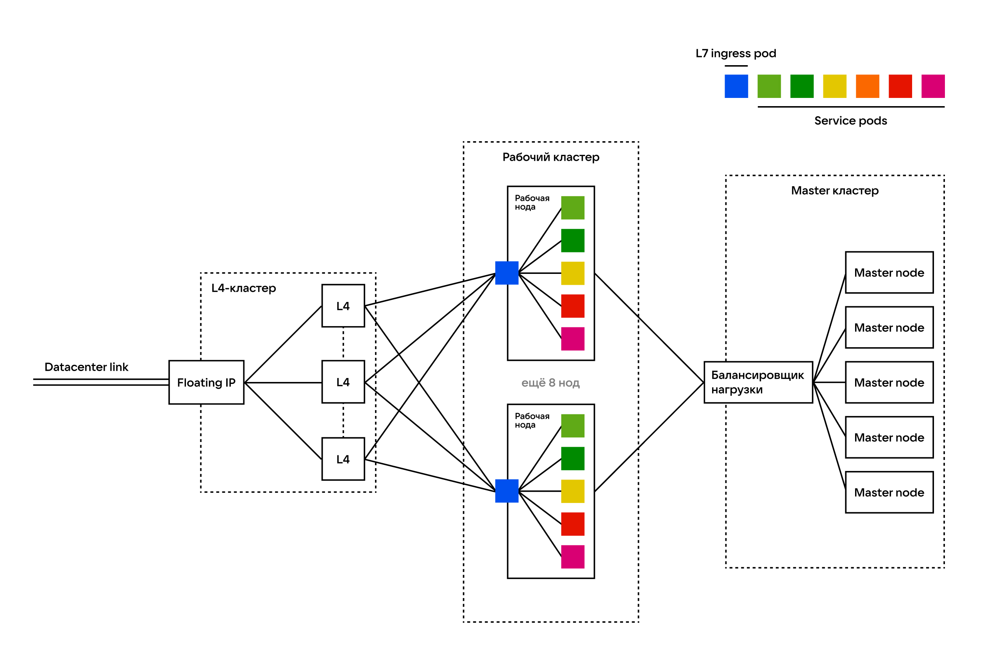
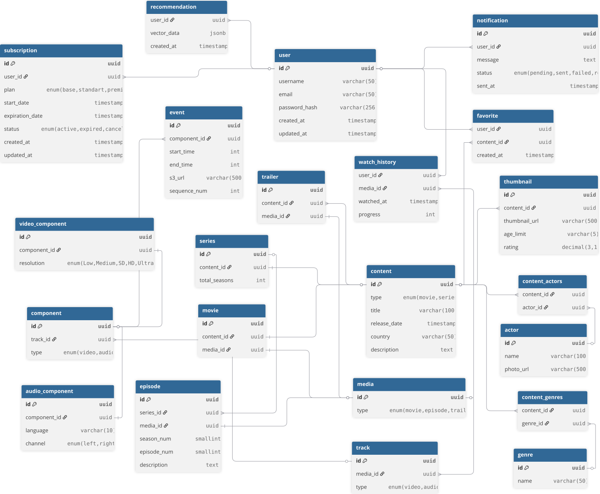

# Netflix | Highload

- Студент: Васютенко Роман Сергеевич
- Группа: WEB-31

## Содержание:
1. [Тема и целевая аудитория](#1-тема-и-целевая-аудитория)
2. [Рассчет нагрузки](#2-расчет-нагрузки)
3. [Глобальная балансировка нагрузки](#3-глобальная-балансировка-нагрузки)
4. [Локальная балансировка нагрузки](#4-локальная-балансировка-нагрузки)
5. [Логическая схема БД](#5-логическая-схема-бд)
6. [Физическая схема БД](#6-физическая-схема-бд)
7. [Алгоритмы](#7-алгоритмы)
8. [Технологии](#8-технологии)
9. [Обеспечение надежности](#9-обеспечение-надежности)
10. [Схема проекта](#10-схема-проекта)
11. [Список серверов](#11-список-серверов)

## 1. Тема и целевая аудитория

**Тема сервиса:** видеостриминговая платформа с персональными рекомендациями, несколькими профилями, офлайн-загрузками и поддержкой высокого качества (HD/4K).

**Основные регионы:** США — 81,44 млн подписчиков, Великобритания — 18,4 млн, Германия — 16,59 млн, Бразилия — 16,59 млн \[1]

**Целевая аудитория:** глобальная аудитория платных подписчиков Netflix.

**Оценочный размер аудитории (MAU):** 301,6 млн платных аккаунтов. \[1]

> В отчётах Netflix «members» — это платные аккаунты; реальное количество индивидуальных зрителей/профилей может быть выше.

### Ключевой функционал MVP

1. Воспроизведение видео
2. Поиск и навигация по каталогу видео
3. Персональная лента рекомендаций (на основе просмотров и профилей).
4. История просмотров, подборки фильмов/сериалов
5. Управление аккаунтом
6. Оффлайн-загрузки и управление скачанными файлами

(Дополнительный функционал включает в себя: лайки/рецензии, live-стримы, торговые интеграция и т.п.)

## 2. Расчет нагрузки

### Продуктовые метрики
- MAU = `301,6 млн` * [^30]
- DAU = 35% * MAU = `105,6 млн` *
- Средняя продолжительность подписки: `4 года` [^5]
- Размер библиотеки: `19 500` **
- Соотношение фильмов и сериалов в библиотеке - `70%` и `30%` соответсвенно [^6]
- 85% потребляемого пользователями в США контента — сериалы [^7]

#### Размер истории просмотров пользователя
- Если соотношение фильмов и сериалов — 70% и 30% соответсвенно, и пользователь в среднем смотрит 63 минуты контента в день [^29], то 44 минуты приходится на сериалы, 19 — на фильмы. Тогда в день пользователь смотрит `44 / 45 = 0,98 серии` и `19 / 90 = 0,21 фильма`. Средняя продолжительность подписки составляет 4 года. То есть пользователь за 4 года посмотрит `(0,98 + 0,21) * 365 * 4 = 1 737 единиц контента`.

\* допущение

\** В 2022 году каталог Netflix состоял из 17 000 позиций [^10]. Рассчитаем примерную скорость роста библиотки. Размер библиотеки в US в 2022 году — 6 473 [^11], в 2024 году — 7 427 [^12]. Следовательно, рост за 2 года составил 14,7%. Тогда на данный момент размер библиотеки равен 17 000 * 1,147 = 19 500.

<!-- #### Общее количество зарегистрированных пользователей
Нет точной статистики по общему количеству пользователей, зарегистрированных на Netflix. Однако можно допустить, что общее количество зарегистрированных за все время пользователей сравнимо с MAU сервиса. То есть, оно составляет `2 млрд` пользователей. -->

#### Средний размер хранилища пользователя

| Тип данных | Размер единицы данных | Количество данных на пользователя | Суммарный размер данных |
| ---------- | ----------------------------- | --------------------------------- | ----------------------- |
| Данные о профиле (логин, email, хэш пароля) | 1 Кб | 1 | `1 Кб` |
| Избранное (ID контента) | 0,1 Кб | 50 | `5 Кб `|
| История просмотров (ID контента + timestamp) | 0,2 Кб | 1 737 | `374 Кб` |
| Рекомендации (векторы рекомендаций) | 30 Кб | 1 | `30 Кб` |
| Push-уведомления | 0,5 Кб | 30 | `15 Кб` |

<!-- **Итого:** 1 + 5 + 30 + 374 + 15 = 713 Кб. -->

<!-- *Из расчета, что в библиотеке соотношение фильмов и сериалов - 70% и 30% соответсвенно, если пользователь в среднем смотрит в день 120 минут контента,
то 84 минут приходится на сериалы и 36 минут на фильмы. Тогда в день пользователь успевает посмотреть в день 84 / 45 = 1.867 серий и 36 / 90 = 0.4 фильма.
Средняя продолжительность подписки составляет 4 года. То есть пользователь успеет посмотреть 1.867 * 365 * 4 = 2726 серий и 0.4 * 365 * 4 = 584 фильма. 
Итого в истории пользователя нужно хранить 2726 + 584 = 3310 позиций. -->

#### Среднее количество действий пользователя по типам в день

| Наименование действия | Расчет количества действий в день | Количество |
| --- | --- | --- |
| Регистрация на сайте | Рост подписчиков за год составил 41,3 млн [^30], т.е. это 41,3 млн / 365 = 113 150 регистраций в день. Тогда один пользователь регистрируется 113 150 / 105,6 млн = 0,001 раз в день | `0,001` |
| Просмотр видео * | Поскольку в среднем просмотр контента составляет 63 минуты в день, то пользователь за это время запрашивает 63 * 60 / 4 = 945 сегментов | `945` |
| Поиск | Пусть пользователь ищет, что посмотреть, раз в 2 дня, при этом при поиске он последовательно применяет фильтры 5 раз (допущение). Тогда, 0,5 * 5 = 2,5 | `2,5` |
| Просмотр страницы фильма/сериала | Пользователи, скорее всего, при каждом действии поиска заходят хотя бы 2 раза посмотреть, что выдал поиск, а также могут открывать страницы фильмов и сериалов на главной странице. Тогда, 2 * 2,5 + 2 = 7 просмотров | `7` |
| Просмотр трейлера на странице фильма или сериала | Пусть пользователь на каждой 5-й открытой странице заходит посмотреть трейлер, тогда 7 * 0,2 = 1,4 действия | `1,4` |
| Просмотр избранного | Редкое действие, пусть оно происходит примерно раз в 10 дней | `0,1` |
| Обращение к истории просмотров | Допущение | `2,5` |
| Просмотр уведомлений | Допущение | `1,5` |

\* При подсчета количества запросов, которые отправляет пользователь при просмотре видео необходимо учитывать, 
что для раздачи контента Netflix использует протокол DASH, который подразумевает разделение загружаемого контента на сегменты. За длительность одного сегмента возьмем `4 секунды` [^13].

### Технические метрики

#### Размер хранения

В облачных хранилищах Netflix хранятся 2 типа видео: *оригинальное видео* и *закодированные видео* (для быстрой отдачи контента разного качества). Также есть 2 основных типа контента: фильмы и сериалы.

Соотношение фильмов и сериалов — 70% и 30% соответсвенно. Тогда:
- Количество фильмов: 0,7 * 19 500 = `13 650`.
- Сериалов: 0,3 * 19 500 = `5 850`.
- Средняя продолжительность фильма: `90 мин`.
- Средняя продолжительность серии: `45 мин`.
- Среднее количество серий в сериале - `16` [^14].
- Средняя общая продолжительность сериала: 45 мин * 16 = 720 мин = `12 ч`.

#### Данные, связанный со страницей фильма или сериала

| Тип данных | Размер единицы данных | Количество данных на странице | Суммарный размер данных |
| ---------- | ----------------------------- | --------------------------------- | ----------------------- |
| Постер | 300 Кб | 1 | 300 Кб |
| Трейлер | 300 000 Кб | 1 | 300 000 Кб |
| Описание | 1 Кб | 1 | 1 Кб |
| Фото актеров | 100 Кб | 10 | 10 000 Кб |

**Итого:** 300 + 300 000 + 1 + 10 000 = 310 301 Кб 
**Без трейлера:** 300 + 1 + 10 000 = `10 301 Кб`

Общее количество актеров: 56 000 [^15].

#### Размер единицы контента закодированного видео

| Качество | Размер часа контента в Гб [^16] | Процент от общего контента | Размер сегмента длительностью 4 cек|
| --- | --- | --- | --- |
| Low | 0,3 Гб | 5% | 349,5 Кб |
| Medium | 0,7 Гб | 15% | 815,6 Кб |
| SD | 1 Гб | 10% | 1 165,1 Кб |
| HD | 3 Гб | 50% * | 3 495,3 Кб |
| Ultra HD | 7 Гб | 20% ** | 8 155,5 Кб |

\* наиболее популярно в мире 
\** наиболее популярно в США

#### Размер единицы контента оригинального видео

Рассчитаем, сколько весит оригинальный RAW видеофайл, который потом кодируется для передачи пользователю. Одна секунда весит 150 Мб. Тогда час видео весит: 150 * 3 600 / 1 024 = 530 Гб [^17]. Каждый такой оригинальный файл хранится в 3-х экземплярах [^18].

#### Размер хранения оригинальных фильмов

| Размер часа | Продолжительность единицы контента (1 фильм) | Количество единиц | Размер в Тб |
| --- | --- | --- | --- |
| 530 Гб | 1,5 ч | 13 650 * 3 | 31 792 Тб |

#### Размер хранения оригинальных сериалов

| Размер часа | Продолжительность единицы контента (1 сериал) | Количество единиц | Размер в Тб |
| --- | --- | --- | --- |
| 530 Гб | 12 ч | 5 850 * 3 | 109 002 Тб |

#### Размер хранения закодированных фильмов

| Качество | Размер часа | Продолжительность единицы контента (1 фильм) | Количество единиц | Размер в Гб |
| --- | --- | --- | --- | --- |
| Low | 0,3 Гб |  1,5 ч | 13 650 | 6 142,5 Гб |
| Medium | 0,7 Гб |  1,5 ч | 13 650 | 14 332,5 Гб |
| SD | 1 Гб |  1,5 ч | 13 650 | 20 475 Гб |
| HD | 3 Гб |  1,5 ч | 13 650 | 61 425 Гб |
| Ultra HD | 7 Гб |  1,5 ч | 13 650 | 143 325 Гб |

**Итого:** 6 142,5 + 14 332,5 + 20 475 + 61 425 + 143 325 = 245 700 Гб = `239,94 Тб`

#### Размер хранения закодированных сериалов

| Качество | Размер часа | Продолжительность единицы контента (1 сериал) | Количество единиц | Размер в Гб |
| --- | --- | --- | --- | --- |
| Low | 0,3 Гб |  12 ч | 5 850 | 21 060 Гб |
| Medium | 0,7 Гб |  12 ч | 5 850 | 49 140 Гб |
| SD | 1 Гб |  12 ч | 5 850 | 70 200 Гб |
| HD | 3 Гб |  12 ч | 5 850 | 210 600 Гб |
| Ultra HD | 7 Гб |  12 ч | 5 850 | 491 400 Гб |

**Итого:** 21 060 + 49 140 + 70 200 + 210 600 + 491 400 = 842 400 Гб = `822,66 Тб`

<!-- #### Размер хранения пользовательских данных

| Размер единицы | Количество единиц | Размер в Тб |
| --- | --- | --- |
| 713 Кб | 2 млрд | 1 328 Тб | -->

<!-- #### Размер хранения данных, связанных со страницей фильма или сериала
| Тип данных | Размер единицы данных | Количество данных | Суммарный размер данных |
| ---------- | --------------------- | ----------------- | ----------------------- |
| Картинка | 300 Кб | 19 500 | 5707 Mб |
| Трейлер | 300 000 Кб | 19 500 | 5 712 891 Mб |
| Описание | 1 Кб | 19 500 | 19 Mб |
| Фото актеров | 100 Кб | 56 438 | 5511 Mб |

Итого: 5707 + 5 712 891 + 19 + 5511 = 5 724 128 Mб = 5,46 Тб

**Итого: 31_792 + 109_002 + 239.94 + 822.66 + 1_328 + 5.46 = 143_190.06 Тб = 139.83 Пб** -->

#### Сетевой трафик

> Prime-time для просмoтора ТВ-шоу в среднем приходится на промежуток 20:00 — 23:00, то есть чтобы определить пиковую нагрузку нужно посмотреть, у каких стран с наибольшим количеством зрителей может пересечься prime-time (разница во времени в странах составляем менее 3-х часов). Это США, Канада и Бразилия, т.е. примерно 30% всех пользователей. Если считать, что в течение 3-х часов prime-time нагрузка распределяется равномерно, можно считать, что в пиковый час нагрузки сервисом совершаются 10% действий.

**Пиковое потребление в течение суток:** `0,1 * суммарный суточный трафик / 3 600 * 8`

| Наименование действия | Расчет суммарного суточного трафика | Суммарный суточный трафик | Пиковое потребление в течение суток |
| --- | --- | --- | --- |
| Регистрация на сайте | 105,6 млн * 0,001 * 1 Кб / (1 024 * 1 024) | `0,1 Гб/сутки` | `0,00002 Гбит/с` |
| Просмотр видео в формате Low | (105,6 млн * 0,05) * 945 * 349,5 Кб / (1 024 * 1 024) | `1 663 000 Гб/сутки` | `379 Гбит/с` |
| Просмотр видео в формате Medium | (105,6 млн * 0,15) * 945 * 815,6 Кб / (1 024 * 1 024) | `11 311 590 Гб/сутки` | `2 513,7 Гбит/с` |
| Просмотр видео в формате SD | (105,6 млн * 0,1) * 945 * 1 165,1 Кб / (1 024 * 1 024) | `11 088 148 Гб/сутки` | `2 464 Гбит/с` |
| Просмотр видео в формате HD | (105,6 млн * 0,5) * 945 * 3 495,3 Кб / (1 024 * 1 024) | `166 322 220 Гб/сутки` | `36 960,5 Гбит/с` |
| Просмотр видео в формате Ultra HD | (105,6 млн * 0,2) * 945 * 8 155,5 Кб / (1 024 * 1 024) | `150 811 947 Гб/сутки` | `33 513,8 Гбит/с` |
| Поиск | 105,6 млн * 2,5 * 1 024 Кб / (1 024 * 1 024) | `257 812 Гб/сутки` | `57,3 Гбит/с` |
| Просмотр страницы фильма или сериала | 105,6 млн * 7 * 10 301 Кб / (1 024 * 1 024) | `7 261 752 Гб/сутки` | `1 613,7 Гбит/с` |
| Просмотр трейлера на странице фильма или сериала | 105,6 млн * 1,4 * 300 000 Кб / (1 024 * 1 024) | `42 297 363 Гб/сутки` | `9 399,4 Гбит/с` |
| Обращение к истории просмотров | 105,6 млн * 2,5 * 374 Кб / (1 024 * 1 024) | `94 162 Гб/сутки` | `20,9 Гбит/с` |
| Просмотр уведомлений | 105,6 млн * 1,5 * 15 Кб / (1 024 * 1 024) | `2 266 Гб/сутки` | `0,5 Гбит/с` |

<!-- Итого: 
Сумарный суточный трафик =  0.00001 + 2_753_800 + 19_278_967 + 18_360_245 + 275_403_677 + 257_037_128 + 49.8 + 6_312_773 + 36_769_867 + 49_263 + 1970 = 615_967_739.8 Гбайт/сутки 
Пиковое потребление в течение суток = 0.00001 + 612.0 + 4284.2 + 4080.1 + 61_200.8 + 57_119.4 + 49.8 + 1402.8 + 8171.1 + 10.9 + 0.4 = 136_931.5 Гбит/сек -->

#### RPS по типам запросов 
**Средний RPS:** `DAU * количество действий в день / 86 400`
**Пиковый RPS:** `0,1 * DAU * количество действий в день / 3 600`

| Наименование действия | Расчет среднего RPS | Средний RPS | Расчет пикового RPS | Пиковый RPS |
| --- | --- | --- | --- | --- |
| Регистрация на сайте | 105,6 млн * 0,001 / 86 400 | `1,2` | 0,1 * 105,6 млн * 0,001 / 3 600 | `2,9` |
| Просмотр видео в формате Low | (105,6 млн * 0,05) * 945 / 86 400 | `57 750` | (0,1 * 105,6 млн * 0,05) * 945 / 3 600 | `138 600` |
| Просмотр видео в формате Medium | (105,6 млн * 0,15) * 945 / 86 400 | `173 250` | (0,1 * 105,6 млн * 0,15) * 945 / 3 600 | `415 800` |
| Просмотр видео в формате SD | (105,6 млн * 0,1) * 945 / 86 400 | `115 500` | (0,1 * 105,6 млн * 0,1) * 945 / 3 600 | `277 200` |
| Просмотр видео в формате HD | (105,6 млн * 0,5) * 945 / 86 400 | `577 500` | (0,1 * 105,6 млн * 0,5) * 945 / 3 600 | `1 386 000` |
| Просмотр видео в формате Ultra HD | (105,6 млн * 0,2) * 945 / 86 400 | `231 000` | (0,1 * 105,6 млн * 0,2) * 945 / 3 600 | `554 400` |
| Поиск | 105,6 млн * 2,5 / 86 400 | `3 056` | 0,1 * 105,6 млн * 2,5 / 3 600 | `7 330` |
| Просмотр страницы фильма или сериала | 105,6 млн * 7 / 86 400 | `8 556` | 0,1 * 105,6 млн * 7 / 3 600 | `20 530` |
| Просмотр трейлера на странице фильма или сериала | 105,6 млн * 1,4 / 86 400 | `1 710` | 0,1 * 105,6 млн * 1,4 / 3 600 | `4 107` |
| Обращение к истории просмотров | 105,6 млн * 2,5 / 86 400 | `3 056` | 0,1 * 105,6 млн * 2,5 / 3 600 | `7 330` |
| Просмотр уведомлений | 105,6 млн * 1,5 / 86 400 | `1 830` | 0,1 * 105,6 млн * 1,5 / 3 600 | `4 400` |

## 3. Глобальная балансировка нагрузки

### Расположение датацентров

Основано на расположении датацентров AWS и Netflix Open Connect [5].

| Регион         | Расположение ДЦ                                | Пользователи | Failover ДЦ        |
| -------------- | ---------------------------------------------- | ------------ | ------------------ |
| США            | Северная Вирджиния, Огайо, Северная Калифорния | 81,44M       | Торонто, Мехико    |
| Европа         | Германия (Франкфурт), Великобритания (Лондон)  | 35M          | Дубай              |
| Южная Америка  | Бразилия (Сан-Паулу)                           | 16,59M       | Мехико             |
| Канада         | Торонто                                        | 5M           | Северная Вирджиния |
| Азия           | Сингапур, Токио                                | 10M          | Дубай              |
| Австралия      | Сидней                                         | 5M           | Сингапур           |
| Ближний Восток | ОАЭ (Дубай)                                    | 2M           | Мумбаи             |
| Мексика        | Мехико                                         | 3,5M         | Сан-Паулу          |

> Для глобальной балансировки используется **GeoDNS**, чтобы пользователи направлялись на ближайший датацентр.
> **DNS Failover** позволяет автоматически переключать трафик на резервные ДЦ при отказе основного.

---

### Разбиение на поддомены / сервисы

| Поддомен / сервис       | Назначение                                     | Характер трафика               | RPS     |
| ----------------------- | ---------------------------------------------- | ------------------------------ | ------- |
| `netflix.com`           | Основной веб-сайт                              | Минимальный                    | 500     |
| `api.netflix.com`       | Метаданные, рекомендации, управление профилями | Средний, write-heavy           | 50 000  |
| `search.netflix.com`    | Поиск контента                                 | Высокий, read-heavy            | 120 000 |
| `content.netflix.com`   | Основной видеоконтент (CDN)                    | Очень высокий, bandwidth-heavy | 26,24M  |
| `images.netflix.com`    | Превью, обложки                                | Высокий, cacheable             | 1,2M    |
| `auth.netflix.com`      | Авторизация и управление аккаунтами            | Средний                        | 30 000  |
| `downloads.netflix.com` | Оффлайн-загрузка видео                         | Высокий                        | 5 000   |

> RPS рассчитан с учётом среднего и пикового числа одновременных пользователей (см. раздел 2). Основной трафик приходится на `content.netflix.com` (CDN), остальные сервисы поддерживают управление метаданными, поиск и авторизацию.

## 4. Локальная балансировка нагрузки

### Балансировка уровней L4 и L7

**L4 — HAProxy / Nginx:**

* Балансировка TCP/UDP соединений
* Используется для статики и видеоконтента
* Алгоритм: Round Robin с весами по производительности серверов

**L7 — Nginx / Envoy:**

* Балансировка HTTP/HTTPS запросов
* Используется для API, поиска, рекомендаций и управления аккаунтами
* Алгоритм: Least Connections с health checks

> SSL Termination выполняется на уровне Ingress подов Kubernetes, снижая нагрузку на сервисные контейнеры. Оркестрация через Kubernetes обеспечивает масштабируемость и надёжность.

---

### Расчёт серверов на один ДЦ (пример: США)

* Пользователей на один ДЦ США: 81,44M / 3 = 27,14M
* Доля общего RPS: 27,14M / MAU = 27,14M / 300M ≈ 0,09
* Глобальный RPS каждого поддомена умножаем на 0,09

| Поддомен                | Глобальный RPS | RPS на ДЦ США | Серверы / поды | RPS/сервер |
| --- | --- | --- | --- | --- |
| `content.netflix.com`   | 26,24M         | 2,36M         | 12             | 196,7k     |
| `images.netflix.com`    | 1,2M           | 108k          | 4              | 27k        |
| `search.netflix.com`    | 120k           | 10,8k         | 2              | 5,4k       |
| `auth.netflix.com`      | 30k            | 2,7k          | 1              | 2,7k       |
| `api.netflix.com`       | 50k            | 4,5k          | 1              | 4,5k       |
| `downloads.netflix.com` | 5k             | 0,45k         | 1              | 0,45k      |

> Под «Серверы / поды» понимаются Kubernetes поды, распределённые по нодам кластера с anti-affinity для отказоустойчивости.

---

### Kubernetes ноды

<!-- * AWS инстансы c5.large (2 vCPU, 4GB RAM) -->
* AWS инстансы c6gn.16xlarge (64 vCPU, 128 GB RAM, 100 Gbit/s)
* Каждый инстанс может поддерживать 5 сервисных подов + 1 Ingress под
* Всего требуется 33 пода → минимум 7 нод
* Для надёжности используем 10 рабочих нод (выдерживают падение 3 нод)
* Мастер-ноды Kubernetes: 5 (для надежности etcd)
* L4 балансировщики над рабочими нодами: 3 (active/passive)

> Ingress поды обрабатывают L7 трафик, DNS поддомены и SSL Termination. L4 балансировщики распределяют TCP/UDP соединения для всего кластера.

---

### Схема локальной балансировки

### Использованные источники

1. Основные регионы по распространенности сервиса и количество зарегистрированных пользователей: [www.demandsage.com](https://www.demandsage.com/netflix-subscribers)

2. Суммарные часы просмотра за первую половину 2025 года: [about.netflix.com](https://about.netflix.com/news/what-we-watched-a-netflix-engagement-report)

3. Данные объёма трафика за час по качествам и технические публикации о битрейтах: [help.netflix.com](https://help.netflix.com/en/node/87)

4. Размер каталога контента: [about.netflix.com](https://about.netflix.com/news/what-we-watched-a-netflix-engagement-report)

5. Официальная страница Open Connect: [openconnect.netflix.com](https://openconnect.netflix.com)

## 5. Логическая схема БД

[Netflix ERD](https://dbdiagram.io/d/692d5cead6676488ba0aaef3)

| Таблица | Описание |
| --- | --- |
| **`user`** | Данные о пользователе. Используется для аутентификации, управления подписками и профилем. |
| `subscription` | Данные о подписках пользователей. |
| **`content`** | Контент, продуктовая сущность. Связана с жанрами, актерами и избранным. |
| `thumbnail` | Данные постеров контента. Используется для отображения на главной странице и страницах фильмов/сериалов. |
| **`media`** | Техническая сущность. Связана с логическими сегментами видео и аудио через дорожки `track` и компоненты `component`. |
| `movie` | Хранит данные, специфичные для фильмов. Связывает продуктовый контент `content` с техническим медиа `media`.  |
| `series` | Хранит данные, специфичные для сериалов. Связана с `content` и `episode`. |
| `episode` | Описывает эпизоды сериалов: номер сезона, номер эпизода, описание. Связана с `series` и `media`. |
| `trailer` | Хранит трейлеры для контента. Отображается на страницах фильмов/сериалов. |
| **`track`** | Дорожка медиа (видео или аудио). Связывает медиа `media` с компонентами `component`. |
| **`event`** | Сегмент медиа во временном промежутке (используется DASH). |
| `component` | Определяет тип сегмента: video (разрешение) или audio (язык, каналы).
| `video_component` | Параметры видео-компонента (разрешение: SD, HD, Ultra HD). |
| `audio_component` | Параметры аудио-компонента: язык и каналы. |
| `actor` | Данные об актёре. |
| `genre` | Данные о жанре. |
| `content_actors` | Связь многие-ко-многим между `content` и `actor`. Используется для отображения актерского состава. |
| `content_genres` | Связь многие-ко-многим между `content` и `genre`. Используется для категоризации. |
| `favorite` | Избранное пользователей. Связывает пользователя `user` с контентом `content`. |
| `watch_history` | История просмотров: связывает пользователя `user` с медиа `media`. |
| `recommendation` | Рекомендации для пользователей. |
| `notification` | Данные об уведомлениях. Используется для оповещений. |

Хранение аудио и видео сегментов реализовано за счет таблиц `media`, `track`, `component` и `event`. Они представляют собой упрощенную схему хранения Media Documents [^27].

### Размеры данных

| Тип данных | Размер |
| --- | --- |
| UUID | 16 байт |
| INT | 4 байт |
| SMALLINT | 2 байт |
| ENUM | 4 байта |
| VARCHAR(n) | n байт |
| DECIMAL(3,1) | 5 байт |
| TEXT | 100-500 байт (среднее значение) |
| TIMESTAMP | 4 байт |
| DATE | 4 байт |
| JSONB | 30 720 байт (в данном случае) |

- Жанров: 28 [^28]
- Фильмов: 12 600
- Сериалов: 5 400
- Объем библиотеки: 12 600 + 5 400 = 18 000
- Эпизодов: 93 000
- Объём `media`: 12 600 фильмов + 93 000 эпизодов + 18 000 трейлеров = 123 600
- Объём `track`: 123 600 * 2 (аудио и видео) = 247 200
- Вариантов разрешения: 3
- Аудиоканалов: 2
- Языков, на которых доступен контент: 20 [^29]
- Объём `video_component`: 3 * 123 600 = 370 800
- Объём `audio_component`: 20 * 2 * 123 600 = 4 944 000
- Длительность всего контента в секундах: (`12 600 фильмов` * `90 минут` + `93 000 эпизодов` * `45 минут` + `18 000 трейлеров` * `3 минуты`) * `60 секунд` = `322 380 000`
- Продолжительность DASH сегмента: 4 секунды
- Объём `events`: `3 * (322 380 000 / 4)` + `20 * 2 * (322 380 000 / 4)` = `3 465 585 000`

| Таблица | Расчет размера строки | Размер строки | Всего строк | Размер таблицы |
| --- | --- | --- | --- | --- |
| `user` | `16 (id)` + `50 (username)` + `50 (email)` + `256 (password_hash)` + `4 (created_at)` + `4 (updated_at)` | `380 байт` | 300 млн | 106 Гб |
| `subscription` | `16 (id)` + `16 (user_id)` + `4 (plan)` + `4 (start_date)` + `4 (expiration_date)` + `4 (status)` + `4 (created_at)` + `4 (updated_at)` | `56 байт` | 300 млн | 15,6 ГБ |
| `content` | `16 (id)` + `4 (type)` + `100 (title)` + `4 (release_date)` + `50 (country)` + `500 (description)` | `674 байт` | 18 000 | 11,6 Мб |
| `thumbnail` | `16 (id)` + `16 (content_id)` + `500 (thumbnail_url)` + `5 (age_limit)` + `5 (rating)` | `542 байт` | 18 000 | 9,3 Мб |
| `media` | `16 (id)` + `4 (type)` | `20 байт` | 123 600 | 2,35 Мб |
| `movie` | `16 (id)` + `16 (content_id)` + `16 (media_id)` | `48 байт` | 12 600 | 0,58 Мб |
| `series` | `16 (id)` + `16 (content_id)` + `4 (total_seasons)` | `36 байт` | 5 400 | 0,19 Мб |
| `episode` | `16 (id)` + `16 (series_id)` + `16 (media_id)` + `2 (season_num)` + `2 (episode_num)` + `500 (description)` | `552 байт` | 93 000 | 49 Мб |
| `trailer` | `16 (id)` + `16 (content_id)` + `16 (media_id)` | `48 байт` | 18 000 | 0,82 Мб |
| `track` | `16 (id)` + `16 (media_id)` + `4 (type)` | `36 байт` | 247 200 | 8,49 Мб |
| `event` | `16 (id)` + `16 (component_id)` + `4 (start_time)` + `4 (end_time)` + `500 (s3_url)` + `4 (sequence_num)` | `544 байт` | 3 465 585 000 | 1,71 Тб |
| `component` | `16 (id)` + `16 (track_id)` + `4 (type)` | `36 байт` | 247 200 | 8,49 Мб |
| `video_component` | `16 (id)` + `16 (component_id)` + `4 (resolution)` | `36 байт` | 370 800 | 12,7 Мб |
| `audio_component` | `16 (id)` + `16 (component_id)` + `10 (language)` + `4 (channel)` | `46 байт` | 4 944 000 | 216,9 Мб |
| `actor` | `16 (id)` + `100 (name)` + `500 (photo_url)` | `616 байт` | 56 000 | 32,9 Мб |
| `genre` | `16 (id)` + `50 (name)` | `66 байт` | 28 | 1,8 Кб |
| `content_actors` | `16 (content_id)` + `16 (actor_id)` | `32 байт` | 180 000 (18 000 * 10) | 5,49 Мб |
| `content_genres` | `16 (content_id)` + `16 (genre_id)` | `32 байт` | 54 000 (18 000 * 3)  | 1,65 Мб |
| `favorite` | `16 (user_id)` + `16 (content_id)` + `4 (created_at)` | `36 байт` | 1,5 млрд (300 млн * 5) | 50,3 Гб |
| `watch_history` | `16 (user_id)` + `16 (media_id)` + `4 (watched_at)` + `4 (progress)` | `40 байт` | 521,1 млрд (300 млн * 1 737) | 19 Тб |
| `recommendation` | `16 (user_id)` + `30 720 (vector_data)` + `4 (created_at)` | `30 740 байт` | 300 млн | 8,39 Тб |
| `notification` | `16 (id)` + `16 (user_id)` + `100 (message)` + `4 (status)` + `4 (sent_at)` | `140 байт` | 9 млрд (300 млн * 30) | 1,15 Тб |

**Итого:** 

[^13]: [DASH Segment Size](https://bitmovin.com/blog/mpeg-dash-hls-segment-length/)
[^27]: [Media Timeline](https://netflixtechblog.com/netflix-mediadatabase-media-timeline-data-model-4e657e6ffe93)
[^28]: [Genres Statistics](https://www.kaggle.com/datasets/evanschreiner/genres)
[^29]: [Language Support](https://netflixtechblog.com/global-languages-support-at-netflix-testing-search-queries-ede40f7d93d3)
[^30]: [Netflix Subscribers Statistics 2025](https://www.demandsage.com/netflix-subscribers/)